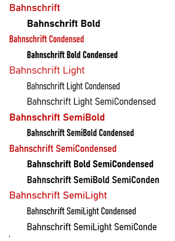
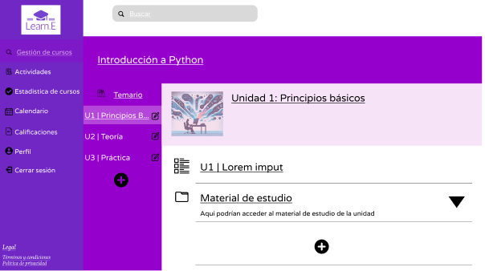
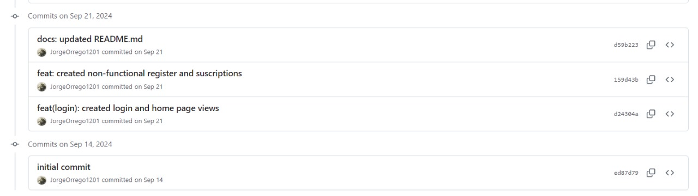
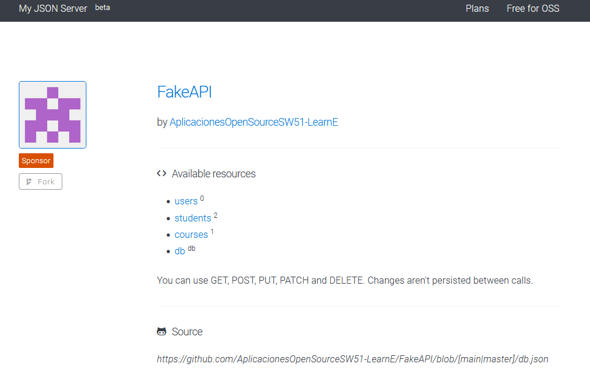

<p align="center" id="caratula">
    <strong>Universidad Peruana de Ciencias Aplicadas</strong><br>
    <br>
    <strong>Ingeniería de Software</strong><br>
    <strong>SI729 Aplicaciones Open Source | SECCIÓN SW51</strong><br>
    <strong>Profesor: Mori Paiva, Hugo Allan</strong><br>
    <br>INFORME DE TRABAJO FINAL
</p>
<p align="center">
    <strong>Startup: LearnE</strong><br>
    <strong>Producto: LearnE</strong>
</p>

<div>
    <h3 align="center">Integrantes:</h3>
</div>

<div align="center">
     <table>
        <tr>
            <th style="text-align:center;">Integrante</th>
            <th style="text-align:center;">Código</th>
        </tr>
        <tr>
            <td>Orrego Noriega, Jorge David</td>
            <td>u201921734</td>
        </tr>
        <tr>
            <td>Huanaco Huayta, Elizabeth Lucero </td>
            <td>u20211g522</td>
        </tr>
        <tr>
            <td>Guía Carrasco, Pedro Andre </td>
            <td>U202212010</td>
        </tr>
        <tr>
            <td>Huapaya Cuevas, Anthony Martin</td>
            <td>U202220235</td>
        </tr>
        <tr>
            <td>Fabrisio Belahonia Miranda</td>
            <td>U202220219</td>
        </tr>
    </table>
</div>

<p align="center">
    <strong>Noviembre 2024</strong>
</p>


# Registro de Versiones del Informe
| Version | Fecha | Autor | Descripcion de Modificacion |
| ----------- | ----------- | ----------- | ----------- |
| 0.0 | 17/08/2024 | Grupo LearnE | Se crea el documento y plantilla de trabajo |
| 1.0 | 22/08/2024 | Grupo LearnE | Se crea la organización y repositorio en GitHub. |
| 2.0 | 25/08/2024 | Grupo LearnE |Desarrollo del Capitulo I: Introducción|
| 3.0 | 27/08/2024 | Grupo LearnE |Desarrollo del Capitulo II: Requeriments Elicitation & Analysis|
| 4.0 | 29/09/2024 | Grupo LearnE |Desarrollo del Capitulo III: Requirements Specification|
| 5.0 | 31/09/2024 | Grupo LearnE |Desarrollo del Capitulo IV: Product Design|
| 6.0 | 31/10/2024 | Grupo LearnE | Desarrollo del Capítulo V: Sprint 2|
| 6.0 | 31/10/2024 | Grupo LearnE | Se desarrolla el Sprint Planning 2, SprintBacklog 2 |
| 7.0 | 31/10/2024 | Grupo LearnE | Se agrega el Testing Suite Evidence, Services Documentation y Software Deployment Evidence|
| 6.0 | 31/10/2024 | Grupo LearnE | Se agrega el Team collaboration Insights during Sprint |
| 6.0 | 31/10/2024 | Grupo LearnE | Inicio del Sprint 3|
| 6.0 | 31/10/2024 | Grupo LearnE | Se desarrolla el Sprint Planning 3, SprintBacklog 3 |
| 7.0 | 31/10/2024 | Grupo LearnE | Se agrega el Development Evidence for Sprint Review |
| 8.0 | 31/10/2024 | Grupo LearnE | Se agrega el Testing Suite Evidence y Services Documentation |
| 9.0 | 31/10/2024 | Grupo LearnE | Se agrega el Software Deployment Evidence for Sprint Review  |
| 10.0 | 31/10/2024 | Grupo LearnE | Se agrega el Team collaboration Insights during Sprint 3 |
| 12.0 | 31/10/2024 | Grupo LearnE | Inicio del desarrollo del informe TB2 |


# Project Report Collaboration Insights

**Commits del Informe TB1:**


# Student Outcome

**ABET – EAC - Student Outcome 3:** Capacidad de comunicarse efectivamente con un rango de audiencias.

|Criterio Especifico|Acciones Realizadas|Conclusiones|
|-|-|-|
| Comunica oralmente con efectividad a diferentes rangos de audiencia. | Elizabeth Huanaco: <br> TB1: <br>La elaboración de User Personas, User Task Matrix y User Journey Mapping ha facilitado una comprensión más profunda de las necesidades de los usuarios a través de una previa coordinación con el equipo y entrevistas. Los Web Applications Wireframes y Wireflow Diagrams han sido clave para presentar la funcionalidad de las aplicaciones, coordinadas con el equipo, de manera clara. En resumen, el proceso de coordinación, las reuniones realizadas y las entrevistas a los usuarios han sido fundamentales para alinear nuestros esfuerzos y asegurar que todas estas actividades se integren eficazmente. <br>TP: <br> He comunicado de forma clara los avances del proyecto a diferentes personas, Presenté nuestras ideas y el progreso en reuniones con el equipo y en la exposición, asegurándome de que todos entendieran el estado y los objetivos del proyecto. También me comuniqué tanto en tiempo real como en mensajes para mantener a todos alineados y facilitar la colaboración en el desarrollo del front-end. <br> TB2: <br> He trabajado en sesiones en tiempo real para culminar el desarrollo del front-end y asegurar que no existan deficiencias en la implementación del backend. También participé en la creación de los videos de presentación del equipo y del producto, con una comunicación clara y atractiva sobre nuestro trabajo. <br><br> Jorge Orrego: <br> TB1: <br> He investigado acerca de la problemática que queremos resolver y en base a eso pude armar los antecedentes. Además, coordiné con mi equipo para elaborar en conjunto las user stories para que todos puedan entender de qué va el proyecto y así puedan aportar ideas acordes a lo que queremos desarrollar. <br> TP: <br> He colaborado de manera síncrona y asíncrona con mis compañeros de equipo en el desarrollo del frontend de nuestra aplicación web. Además, expuse sobre mis avances y participación en el trabajo.<br> <br> TB2: <br> He colaborado de manera tanto síncrona como asíncrona para el desarrollo del backend, además de realizar parte de los videos de About-The-Team y About-The-Product. <br><br> Pedro Guia <br> TB1: <br>La elaboración del Domain-Driven Software Architecture simplifico los detalles del proyecto, gracias al contexto, contenedor y componente que desarrollaremos. No obstante, al realizar el DDS tenemos la base de datos entidad-relación que permite los detalles del sistema sean entendibles.<br> TP: <br>He colaborado de manera síncrona y asíncrona con mis compañeros de equipo en el desarrollo del frontend de nuestra aplicación web. Además, expuse sobre mis avances y participación en el trabajo.<br> TB2: <br>En este entregable desarrolle el backend de Learne, basado en el lenguaje Java. El endpoint implemento fue Learn, que lleva los cursos en esta aplicación. De igual manera se desplego el backend en Swagger. <br><br> Anthony Huapaya: <br> TB1: <br>La realización del Lean UX Canvas, el cual ayudo en poder sintetizar toda la información de los demás Lean UX Statements en un solo cuadro. Además, con la elaboración de los Empathy Mapping, As-Is Scenario, To-Be Scenario e Impact Mapping ayudando en comprender de mejor manera lo que nosotros buscamos ayudar al problema que nos hemos planteado. Los Web Applications Wireframes y Wireflow Diagrams han ayudado en identificar las funcionalidades que presentará nuestra aplicación, lo cual se efectuará gracias al trabajo de equipo y las correctas coordinaciones de ellas.<br>TP:<br>Me mantuve en comunicación constante con el grupo para verificar los avances que se iban realizando en el front-end de nuestro proyecto, me comunicaba mediante mensajes constantes para la verificación del avance del proyecto. <br>TB2:<br>He trabajado en sesiones en tiempo real para terminar el desarrollo del front-end, ya que tenía que asegurar que no tuviera complicaciones en la implementación del backend.<br><br>Fabrisio Belahonia : <br> TB1: <br> La comunicación efectiva con el equipo fue fundamental para alcanzar los objetivos y asegurar una excelente coordinación. Esto resultó especialmente crucial en la elaboración de los User Personas, User Task Matrix y User Journey Mapping, ya que su éxito dependía directamente de las entrevistas realizadas por otros miembros del equipo. Además, el análisis de competidores jugó un papel clave para identificar oportunidades y amenazas en el mercado. A partir de este análisis, desarrollamos una estrategia sólida que nos permitió diferenciarnos de la competencia, mejorando nuestra propuesta de valor y alineando nuestras tácticas con las necesidades de los usuarios.<br> TP:<br>He trabajado tanto de forma síncrona como asíncrona con mis compañeros de equipo en el desarrollo del frontend de nuestra aplicación web. Además, compartí mis avances e hice uso de github.<br> TB2:<br>He trabajado en la correción del frontend, redación de la documentacion, entrevistas, evaluaciones de heuristica. Ademas, de una continua comunicacion con el grupo por cada sprint <br> |  TB1: <br> Se pudo comunicar efectivamente el propósito de nuestro trabajo por medio de la exposición <br><br> TP: <br> Se pudo comunicar efectivamente el proceso de desarrollo de nuestra aplicación por medio de las exposiciones. <br><br> TB2: <br> Se pudo comunicar efectivamente el proceso de desarrollo de nuestra aplicación tanto por medio de la exposición grabada como por los videos de About-The-Team y About-The-Product. |
| Comunica por escrito con efectividad a diferentes rangos de audiencia.| Elizabeth Huanaco: <br> TB1: <br>La elaboración de User Personas, User Task Matrix y User Journey Mapping ha permitido documentar de manera detallada las necesidades y experiencias de los usuarios, lo que se refleja este informe. Asimismo, la preparación de Class Diagrams y Class Dictionary ha permitido que los detalles del sistema sean presentados de manera comprensible y accesible en este informe escrito. <br> TP: <br> Escribí las secciones del informe relacionadas con la implementación del frontend de nuestra aplicación, que incluyen la documentación de la interfaz de usuario y además, me comuniqué constantemente por escrito con los integrantes de mi grupo para asegurar el desarrollo del front-end. <br> TB2: <br> Me comuniqué continuamente con los integrantes de mi grupo para coordinar los avances y la finalización del front-end de nuestro proyecto, y asegurar que todos estemos alineados con respecto a la etapa del desarrollo del back-end.<br><br> Jorge Orrego: <br> TB1: <br> Redacté el contenido de la sección Software Configuration Management para dar a conocer cómo vamos a desarrollar el proyecto desde un enfoque más técnico. También ayudé con la creación de los Mockups de nuestra aplicación web. <br> TP: <br> Redacté secciones del informe relacionadas a las evidencias de despliegue de nuestra aplicación y sobre la documentación de los servicios. <br> TB2: <br> Redacté parte de la documentación del backend acerca de cómo consumir los endpoints de la API, además de completar el informe en las partes de Service Documentation, Software Deployment y Execution Evidence del Sprint 3. <br><br> Pedro Guia <br> TB1: <br>La elaboración del Domain-Driven Software Architecture simplifico los detalles del proyecto, gracias al contexto, contenedor y componente que desarrollaremos. No obstante, al realizar el DDS tenemos la base de datos entidad-relación que permite los detalles del sistema sean entendibles.<br> TP: <br>Redacté secciones del informe relacionadas a las evidencias de despliegue de nuestra aplicación y sobre la documentación de los servicios. <br> TB2: <br> Para esta entrega, comunique que desarrollaría el backend de la aplicación mediante una base de datos MySQL. <br><br>Anthony Huapaya: <br> TB1: <br>La elaboración de los mapas Empathy, As-Is Scenario, To-Be Scenario e Impact han permitido que la documentación acerca del problema a resolver sea de manera más eficaz y sintetizada para la fácil compresión, donde se muestra ello en el informe. Además, la realización de la Class Diagram permitió ver los detalles que tiene el sistema con una facilidad de compresión para el informe.<br>TP:<br>Para lograr cumplir con los objetivos marcados para esta entrega, me comunicaba constantemente por escrito a mi grupo para que sepan el avance que realicé y de ellos también. Gracias a ello, lograbamos realizar el correcto avance del front-end del proyecto que realizamos.<br>TB2:<br>Me comunicaba de manera constante con el grupo para coordinar el avance del proyecto, asegurando que todos tengamos la misma idea sobre lo que debemos llevar a cabo y no hubiera mal entendidos, además de la finalización del front-end para el correcto desarrollo del back-end.<br><br>Fabrisio Belahonia : <br> TB1: <br> La elaboración del análisis de competidores, junto con las estrategias diseñadas frente a ellos y el análisis detallado de las entrevistas, ha permitido documentar de manera exhaustiva el desarrollo de la competencia, identificar sus puntos débiles y definir cómo podemos destacar sobre ellos. Además, la redacción de las entrevistas nos proporciona una visión clara sobre las necesidades y expectativas de nuestro segmento objetivo, lo que nos permite ajustar nuestras estrategias para ofrecer una propuesta más alineada y diferenciada.<br><br> TP:<br> Realicé mis pantallas y el desarrolo del frontend que me tocaba con respecto al sprint 2, inplentancdo servicions, entidades, etc.<br> TB2:<br> Realicé las correcciones de mis pantallas anteriores del frontend, entrevistas, sprint backlog, diseño de entrevistas,pruebas de heuristica, etc. <br>  | TB1: <br> Se pudo comunicar efectivamente el propósito de nuestro trabajo por medio del informe <br><br> TP: <br> Se pudo documentar tanto la funcionalidad como el despliegue de nuestra aplicación web en el informe. <br><br> TB2: <br> Se pudo documentar tanto la funcionalidad del frontend como la de los web services en el informe y en Swagger en el caso de los web services. |

# Contenido

1. [Capítulo I: Introducción](#cap1)<br>
   1.1. [Startup Profile](#1.1.)<br>
      1.1.1. [Descripción del startup](#1.1.1.)<br>
      1.1.2. [Perfiles de los integrantes del equipo](#1.1.2.)<br>
   1.2. [Solution Profile](#1.2.)<br>
      1.2.1. [Antecedentes y Problemática](#1.2.1.)<br>
      1.2.2. [Lean UX Process](#1.2.2.)<br>
        1.2.2.1. [Lean UX Problem Statements](#1.2.2.1.)<br>
        1.2.2.2. [Lean UX Assumptions](#1.2.2.2.)<br>
        1.2.2.3. [Lean UX Hypothesis Statements](#1.2.2.3.)<br>
        1.2.2.4. [Lean UX Canvas](#1.2.2.4.)<br>
   1.3. [Segmentos objetivo](#1.3.)<br>
2. [Capítulo II: Requirements Elicitation & Analysis](#cap2)<br>
   2.1. [Competidores](#2.1.)<br>
      2.1.1. [Análisis competitivo](#2.1.1.)<br>
      2.1.2. [Estrategias y tácticas frente a competidores](#2.1.2.)<br>
   2.2. [Entrevistas](#2.2.)<br>
      2.2.1. [Diseño de entrevistas](#2.2.1.)<br>
      2.2.2. [Registro de entrevistas](#2.2.2.)<br>
      2.2.3. [Análisis de entrevistas](#2.2.3.)<br>
   2.3. [Needfinding](#2.3.)<br>
      2.3.1. [User Personas](#2.3.1.)<br>
      2.3.2. [User Task Matrix](#2.3.2.)<br>
      2.3.3. [User Journey Mapping](#2.3.3.)<br>
      2.3.4. [Empathy Mapping](#2.3.4.)<br>
      2.3.5. [As-is Scenario Mapping](#2.3.5.)<br>
   2.4. [Ubiquitous Language](#2.4.) <br>
3. [Capítulo III: Requirements Specification](#cap3)<br>
   3.1. [To-Be Scenario Mapping](#3.1.)<br>
   3.2. [User Stories](#3.2.)<br>
   3.3. [Impact Mapping](#3.3.)<br>
   3.4. [Product Backlog](#3.4.)<br>
4. [Capítulo IV: Product Design](#cap4)<br>
   4.1. [Style Guidelines](#4.1.)<br>
      4.1.1. [General Style Guidelines](#4.1.1.)<br>
      4.1.2. [Web Style Guidelines](#4.1.2.)<br>
   4.2. [Information Architecture](#4.2.)<br>
      4.2.1. [Organization Systems](#4.2.1.)<br>
      4.2.2. [Labeling Systems](#4.2.2.)<br>
      4.2.3. [SEO Tags and Meta Tags](#4.2.3.)<br>
      4.2.4. [Searching Systems](#4.2.4.)<br>
      4.2.5. [Navigation Systems](#4.2.5.)<br>
   4.3. [Landing Page UI Design](#4.3.)<br>
      4.3.1. [Landing Page Wireframe](#4.3.1.)<br>
      4.3.2. [Landing Page Mock-up](#4.3.2.)<br>
   4.4. [Web Applications UX/UI Design](#4.4.)<br>
      4.4.1. [Web Applications Wireframes](#4.4.1.)<br>
      4.4.2. [Web Applications Wireflow Diagrams](#4.4.2.)<br>
      4.4.3. [Web Applications Mock-ups](#4.4.3.)<br>
      4.4.4. [Web Applications User Flow Diagrams](#4.4.4.)<br>
   4.5. [Web Applications Prototyping](#4.5.)<br>
   4.6. [Domain-Driven Software Architecture](#4.6.)<br>
      4.6.1. [Software Architecture Context Diagram](#4.6.1.)<br>
      4.6.2. [Software Architecture Container Diagrams](#4.6.2.)<br>
      4.6.3. [Software Architecture Components Diagrams](#4.6.3.)<br>
   4.7. [Software Object-Oriented Design](#4.7.)<br>
      4.7.1. [Class Diagrams](#4.7.1.)<br>
      4.7.2. [Class Dictionary](#4.7.2.)<br>
   4.8. [Database Design](#4.8.)<br>
      4.8.1. [Database Diagram](#4.8.1.)<br>
5. [Capítulo V: Product Implementation, Validation & Deployment](#cap5)<br>
   5.1. [Software Configuration Management](#5.1.)<br>
      5.1.1. [Software Development Environment Configuration](#5.1.1.)<br>
      5.1.2. [Source Code Management](#5.1.2.)<br>
      5.1.3. [Source Code Style Guide & Conventions](#5.1.3.)<br>
      5.1.4. [Software Deployment Configuration](#5.1.4.)<br>
   5.2. [Landing Page, Services & Applications Implementation](#5.2.)<br>
      5.2.1. [Sprint 1](#5.2.1.)<br>
         5.2.1.1. [Sprint Planning 1](#5.2.1.1.)<br>
         5.2.1.2. [Sprint Backlog 1](#5.2.1.2.)<br>
         5.2.1.3. [Development Evidence for Sprint Review](#5.2.1.3.)<br>
         5.2.1.4. [Testing Suite Evidence for Sprint Review](#5.2.1.4.)<br>
         5.2.1.5. [Execution Evidence for Sprint Review](#5.2.1.5.)<br>
         5.2.1.6. [Services Documentation Evidence for Sprint Review.](#5.2.1.6.)<br>
         5.2.1.7. [Software Deployment Evidence for Sprint Review.](#5.2.1.7.)<br>
         5.2.1.8. [Team Collaboration Insights during Sprint.](#5.2.1.8.)<br>
      5.2.2. [Sprint 2](#5.2.2.)<br>
         5.2.2.1. [Sprint Planning 2](#5.2.2.1.)<br>
         5.2.2.2. [Sprint Backlog 2](#5.2.2.2.)<br>
         5.2.2.3. [Development Evidence for Sprint Review](#5.2.2.3.)<br>
         5.2.2.4. [Testing Suite Evidence for Sprint Review](#5.2.2.4.)<br>
         5.2.2.5. [Execution Evidence for Sprint Review](#5.2.2.5.)<br>
         5.2.2.6. [Services Documentation Evidence for Sprint Review.](#5.2.2.6.)<br>
         5.2.2.7. [Software Deployment Evidence for Sprint Review.](#5.2.2.7.)<br>
         5.2.2.8. [Team Collaboration Insights during Sprint.](#5.2.2.8.)<br>
      5.2.3. [Sprint 3](#5.2.3.)<br>
         5.2.3.1. [Sprint Planning 3](#5.2.3.1.)<br>
         5.2.3.2. [Sprint Backlog 3](#5.2.3.2.)<br>
         5.2.3.3. [Development Evidence for Sprint Review](#5.2.3.3.)<br>
         5.2.3.4. [Testing Suite Evidence for Sprint Review](#5.2.3.4.)<br>
         5.2.3.5. [Execution Evidence for Sprint Review](#5.2.3.5.)<br>
         5.2.3.6. [Services Documentation Evidence for Sprint Review.](#5.2.3.6.)<br>
         5.2.3.7. [Software Deployment Evidence for Sprint Review.](#5.2.3.7.)<br>
         5.2.3.8. [Team Collaboration Insights during Sprint.](#5.2.3.8.)<br>
    5.3. [Validation Interviews](#5.3.)<br>
       5.3.1. [Diseño de Entrevistas](#5.3.1.)<br>
       5.3.2. [Registro de Entrevistas](#5.3.2.)<br>
       5.3.3. [Evaluaciones según Heurísticas](#5.3.3.)<br>
    5.4. [Validation Interviews](#5.4.)<br>
6. [Conclusiones](#conclusiones)<br>
7. [Bibliografía](#bibliografía)<br>
8. [Anexos](#anexos) <br>

   
# Capítulo I: Introducción <a name ="cap1">

## 1.1. Startup Profile <a name ="1.1.">

### 1.1.1. Descripción de la Startup <a name ="1.1.1.">
Cuenta con la capacidad de enseñar las materias académicas de forma lúdica, autodidacta y divertida, haciendo uso de herramientas gráficas con el fin de fomentar la creatividad e ingenio de los clientes para comprender el uso de las materias de aprendizaje a futuro académico o laboral. 

Entre las materias principales se encuentra el uso de las matemáticas, estadística, física, biología, lenguaje, entre otros. Así mismo, el usuario podrá visualizar el temario de los cursos que guste llevar. Además, se incorporarán exámenes semanales para tener en cuenta el rendimiento del usuario en el curso.

Será una aplicación con dos planes de suscripción, el primero es de ámbito freemium, esto quiere decir que solo contará con las funciones básicas y podrá llevar un límite de materias. No obstante, habrá un plan mensual que permitirá al usuario tener gran cantidad de herramientas y cursos asignados.


#### 1.1.2. Perfiles de integrantes del equipo <a name ="1.1.2.">

<table align="center" border="1" width="70%" style="text-align:center; border-collapse: collapse;">
  <!-- Belahonia Miranda, Fabrisio Andre -->
  <tr align="center">
    <td rowspan="3" width="30%">
       
    </td>
    <td align="left" style="padding: 10px;">
      <b>Nombre y Apellido:</b><br>
         Fabrisio Andre Belahonia Miranda
    </td>
  </tr>
  <tr>
    <td align="left" style="padding: 10px;">
      <b>Carrera:</b><br>
         Ingeniería de Software
    </td>
  </tr>
  <tr>
    <td align="left" style="padding: 10px;">
      <b>Acerca de:</b><br>
 Mi nombre es Fabrisio Belahonia, estudiante de Ing. de software. Voy cursando el 5to ciclo de mi carrera, y me considero una persona responsable, ordenado, empático. Me interesa el área de Ciberseguridad y tengo experiencia con Linux, Redes, Cloud, etc.    </td>
  </tr>
  <!-- Huanaco Huayta, Elizabeth Lucero -->
  <tr align="center">
    <td rowspan="3" width="30%">
        
    </td>
    <td align="left" style="padding: 10px;">
      <b>Nombre y Apellido:</b><br>
         Elizabeth Lucero Huanaco Huayta
    </td>
  </tr>
  <tr>
    <td align="left" style="padding: 10px;">
      <b>Carrera:</b><br>
         Ingeniería de Software
    </td>
  </tr>
  <tr>
    <td align="left" style="padding: 10px;">
      <b>Acerca de:</b><br>
      Estudio la carrera de Ingeniería de Software en la Universidad Peruana de Ciencias Aplicadas porque me interesa el campo de la tecnología. Elegí enfocarme en esta carrera por el interés que tengo en el desarrollo de software, ya que considero que es un área clave para el futuro de la innovación tecnológica.
    </td>
  </tr>
  <!-- Anthony Martin Huapaya Cuevas -->
  <tr align="center">
    <td rowspan="3" width="30%">
       
    </td>
    <td align="left" style="padding: 10px;">
      <b>Nombre y Apellido:</b><br>
         Anthony Martin Huapaya Cuevas
    </td>
  </tr>
  <tr>
    <td align="left" style="padding: 10px;">
      <b>Carrera:</b><br>
      Ingeniería de Software
    </td>
  </tr>
  <tr>
    <td align="left" style="padding: 10px;">
      <b>Acerca de:</b><br>
      Estudio la carrera de Ingeniería de Software en la Universidad Peruana de Ciencias Aplicadas y la razón por la que escogí estudiar esa carrera es por el enfoque de la tecnología, la cual decidí enfocarme en el apartado de la programación del software.
  </tr>
  <!-- Pedro Andre Guía Carrasco -->
  <tr align="center">
    <td rowspan="3" width="30%">
       
    </td>
    <td align="left" style="padding: 10px;">
      <b>Nombre y Apellido:</b><br>
      Pedro Andre Guia Carrasco
    </td>
  </tr>
  <tr>
    <td align="left" style="padding: 10px;">
      <b>Carrera:</b><br>
      Ingeniería de Software
    </td>
  </tr>
  <tr>
    <td align="left" style="padding: 10px;">
      <b>Acerca de:</b><br>
      Estudio en la Universidad Peruana de Ciencias Aplicadas la carrera de Ingenieria de Software, voy por mi 6° ciclo academico y la razón por la que escogi esta carrera es por el futuro innovador que brindara a la sociedad.
      Estudio en la Universidad Peruana de Ciencias Aplicadas la carrera de Ingenieria de Software, voy por mi 6° ciclo academico y la razón por la que escogi esta carrera es por el futuro innovador que brindara a la sociedad.
    </td>
  </tr>
  <!-- Jorge David Orrego Noriega -->
  <tr align="center">
    <td rowspan="3" width="30%">
       
    </td>
    <td align="left" style="padding: 10px;">
      <b>Nombre y Apellido:</b><br>
      Jorge David Orrego Noriega
    </td>
  </tr>
  <tr>
    <td align="left" style="padding: 10px;">
      <b>Carrera:</b><br>
      Ingeniería de Software
    </td>
  </tr>
  <tr>
    <td align="left" style="padding: 10px;">
      <b>Acerca de:</b><br>
      Estudio actualmente la carrera de Ingeniería de Software en la Universidad Peruana de Ciencias Aplicadas y la razón por la cual me encuentro estudiando esta carrera es porque siempre he tenido un interés particular por la tecnología, con un mayor énfasis en el software.
    </td>
  </tr>
</table>


## 1.2. Solution Profile <a name ="1.2.">

### 1.2.1 Antecedentes y problemática <a name ="1.2.1.">

**Antecedentes:** 

A medida que pasa el tiempo, las maneras en las cuales se está educando a cualquier tipo de estudiante han ido cambiando y, a su vez, adaptándose a las nuevas necesidades de nuestra actual era digital. Es así como las computadoras o equipos similares pasaron de ser parte de ciertas clases en la malla curricular a ser indispensables para poder desarrollarse plenamente en el ámbito académico. Este cambio de paradigma en la educación moderna se vio acelerado por la pandemia del COVID-19 a inicios del 2020, en donde se puso en evidencia la importancia por parte de cualquier institución educativa superior de poseer la infraestructura necesaria para seguir brindando clases.  


Esta tendencia desembocó en el aumento de alumnos matriculados tanto en cursos masivos abiertos en línea (o mejor conocidos como massive open online courses en inglés) de 300,000 a 220 millones desde 2011 hasta 2019 como en modalidades de aprendizaje a distancia en universidades tradicionales en un 92% en el 2020 (Diaz-Infante et al., 2022). Además, se vieron a gran escala los beneficios de las tecnologías de aprendizaje virtual que van desde la mejora de la interacción de los alumnos con las clases hasta la mejora de acceso a nuevas herramientas de aprendizaje para personas que no tienen los recursos para pagar una educación formal tradicional (Haleem et al., 2022).


**Problemática:**

* ¿Qué?: El problema radica en la necesidad de herramientas alternativas para el aprendizaje autónomo que, además de contar con recursos educativos de calidad, también brinde la oportunidad de interactuar y de aprender con tutores a su disposición. 
* ¿Quién?: Los principales afectados son personas que no tienen recursos necesarios para aprender por medios de educación superior (universidades o institutos) junto a los mismos estudiantes de dichas instituciones que requieran de conocimiento extra para desempeñarse mejor en sus estudios. 
* ¿Por qué?: La principal causa de esta problemática es la falta de herramientas virtuales que puedan brindarle al alumno tanto herramientas y material de calidad como el acompañamiento especializado de un tutor durante su periodo de aprendizaje. Esto puede impedir el desarrollo tanto profesional como laboral de varias personas que no tienen un acceso ideal a recursos educativos. 
* ¿Dónde?: Es un desafío que se presenta a un nivel global, más aún cuando se trata de comunidades o regiones con recursos limitados o con acceso restringido a educación de alta calidad. 
* ¿Cuándo?: Este problema se puede dar a lo largo de la vida de un estudiante, ya que siempre va a necesitar expandir y actualizar sus conocimientos. 
* ¿Cómo?: Esta situación es consecuencia tanto de un modelo educativo que no se ha adaptado para el uso eficiente de nuevas tecnologías, como de la falta de promoción de nuevas herramientas virtuales que puedan ayudar con la distribución de la educación a más personas. 
* ¿Cuánto?: A varias empresas de diferentes rubros les está costando encontrar personal calificado para sus puestos de trabajo, lo cual podría resultar en la disminución de la productividad y hasta pérdidas económicas (Diaz-Infante et al., 2022). 


### 1.2.2 Lean UX Process. <a name ="1.2.2.">
#### 1.2.2.1. Lean UX Problem Statements. <a name ="1.2.2.1.">
Hemos podido observar que existe gente con el deseo de seguir aprendiendo tanto en lo académico como en lo laboral. Sin embargo, muchos se enfrentan a la falta de una metodología de enseñanza adecuada o eficaz que facilite la comprensión profunda de las materias. Los métodos tradicionales de enseñanza a menudo no se adaptan a las necesidades individuales de los estudiantes, lo que resulta en frustración, pérdida de interés y una comprensión superficial de los temas. Además, la falta de acceso a recursos de aprendizaje personalizados limita el crecimiento personal y profesional, afectando negativamente las oportunidades en el mercado laboral.<br>
Como consecuencia, no podrían comprender temas posteriores porque no tuvieron bases sólidas de aprendizaje en aquellos cursos académicos. Frente a esta problemática, planteamos la siguiente pregunta: <br><br>
¿Cómo podríamos promover el aprendizaje de aquellos cursos académicos en las personas autodidactas y didácticas?

#### 1.2.2.2. Lean UX Assumptions. <a name ="1.2.2.2.">

| Business Assumptions | User Assumptions |
| --------------------|-------------------|
| Creemos que nuestros usuarios tienen la necesidad de aprender nuevos temas académicos de una forma más interactiva y autodidacta. | Los usuarios de este producto son personas que ya hayan acabado sus estudios secundarios y deseen aprender más acerca de un tema en específico de una manera interactiva y personalizada. |
| Este problema se puede solucionar por medio de métodos de aprendizaje que tengan en cuenta las necesidades y limitaciones de los alumnos. | Nuestro producto podría encajar como un complemento para el aprendizaje diario de nuestros usuarios, dependiendo de su organización de su estudio académico. |
| Los usuarios serán personas que ya hayan terminado sus estudios secundarios y que deseen aprender más acerca de un tema de manera interactiva y personalizada.| Este producto podrá resolver la falta de conocimiento de nuestros usuarios de cualquier tema que les sea relevante ya sea en su vida profesional o académica. |
| La propuesta de valor #1 de nuestra plataforma que nuestros clientes quieren aprovechar es la oportunidad de poder manejar su ritmo y avance de aprendizaje.| El producto se podrá utilizar en cualquier horario que el usuario crea conveniente, a excepción de las tutorías. Se podrá acceder a la plataforma desde cualquier computadora que cuente con un navegador web.|
| Dado que la plataforma cuenta con planes freemium y premium, el usuario podrá optar por obtener más beneficios si es que se suscribe al plan premium como la habilitación de cursos con un nivel de profundidad más avanzado, tutorías personalizadas, etc.| La características más importantes de nuestra plataforma es que pueda ser accedida por cualquier usuario a cualquier hora del día, el poseer un catálogo amplio de cursos de distintos temas y el contar con tutores que puedan complementar el aprendizaje de nuestros usuarios.|
| Se buscará conseguir la mayoría de nuestros usuarios por medio de márketing digital, además de promocionar nuestros servicios en círculos universitarios o redes sociales.
| Nuestro producto se tiene que dar a conocer como un complemento al aprendizaje de nuestros usuarios y se debería comportar de tal manera que ayude en el entendimiento de nuevos conocimientos.|
| Se conseguirán ingresos a través de las suscripciones premium. | |
| Nuestros competidores principales serán Khan Academy, Platzi y Udemy.| |
| Los venceremos brindándoles a nuestros usuarios tutorías en vivo con un tutor especializado en tema como complemento a los cursos ofrecidos en la plataforma. | |
| El mayor riesgo del producto es la disponibilidad de tutores para la cantidad de usuarios que puedan haber.  | |
| Se solucionará esto con una convocatoria masiva de tutores por medio de redes sociales.| |
|Un supuesto que en caso se pruebe que sea falso pueda causar que el proyecto falle sería la demanda por los servicios ofrecidos en nuestra plataforma. | |

#### 1.2.2.3. Lean UX Hypothesis Statements. <a name ="1.2.2.3.">
- Creemos que al ofrecer una plataforma de aprendizaje autodidacta y lúdica con herramientas gráficas y tutorías personalizadas, mejoramos la comprensión y retención de conceptos académicos en nuestros usuarios. 
Sabremos que esta hipótesis es cierta si vemos un aumento en la tasa de finalización de cursos y un feedback positivo en la satisfacción de los usuarios respecto a la claridad y profundidad de los contenidos.

- Creemos que un modelo de suscripción freemium que ofrezca acceso limitado pero efectivo a recursos educativos incentivará a los usuarios a optar por la suscripción mensual para obtener acceso completo a las herramientas y cursos. 
Sabremos que esta hipótesis es cierta si observamos una tasa de conversión significativa de usuarios del plan freemium al plan mensual, motivados por la necesidad de más recursos para su aprendizaje.
#### 1.2.2.4. Lean UX Canvas. <a name ="1.2.2.4.">
<table border="1" style="text-align: left;">  
  <tr>
    <th style="text-align: center;">Business Problem</th>
    <th style="text-align: center;">Solution Ideas</th>
    <th style="text-align: center;">Business Outcomes</th>
  </tr>
  <tr>
    <td>
        <ul>
            <li>Personas que quieren continuar aprendiendo, pero se enfrentan a la falta de metodologías eficaces.</li>
            <li>La falta de adaptabilidad con respecto a las metodologías tradicionales.</li>
        </ul>
    </td>
    <td rowspan="2">
        <ul>
            <li>Se visualiza el aumento en la tasa de finalización de cursos y un feedback positivo en la satisfacción de los usuarios respecto a la claridad y profundidad de los contenidos.</li>
            <li>Al ver una tasa de conversión significativa de usuarios del plan freemium al plan mensual, motivados por la necesidad de más recursos para su aprendizaje.</li>
        </ul>
    </td>
    <td>
        <ul>
            <li>Aumento de aprobación en los estudios con respecto a cada curso.</li>
            <li>Aumento de suscripciones mensuales más que el uso de cuentas freemium.</li>
        </ul>
    </td>
  </tr>
  <tr>
    <th style="text-align: center;">Users</th>
    <th style="text-align: center;">User Benefits</th>
  </tr>
  <tr>
    <td>
        <ul>
            <li>Profesores</li>
            <li>Alumnos</li>
        </ul>
    </td>
    <th style="text-align: center;">What’s the most important thing we need to learn first?</th>
    <td>
        <ul>
            <li>En los alumnos se ve una mejora en sus rendimientos académicos.</li>
            <li>Los profesores tienen comodidad al momento de explayarse en la clase.</li>
        </ul>
    </td>
  </tr>
  <tr>
    <th style="text-align: center;">Hypotheses</th>
    <td rowspan="2">
        <ul>
            <li>Entender los problemas que sufren los estudiantes al momento de aprender las tutorías en línea.</li>
            <li>Comprender el funcionamiento de los sistemas de subscripciones con respecto al tema de aprendizaje.</li>
        </ul>
    </td>
    <th style="text-align: center;">What’s the least amount of work we need to do learn the next most important thing?</th>
  </tr>
  <tr>
    <td>
        <ul>
            <li>Creemos que una plataforma de aprendizaje autodidacta y lúdica con herramientas gráficas y tutorías personalizadas mejorará la comprensión y retención de conceptos académicos en nuestros usuarios.</li>
            <li>Creemos que un modelo de suscripción freemium limitado pero efectivo con respectos a los recursos educativos incentivará la suscripción mensual para obtener acceso completo a las herramientas y cursos.</li>
        </ul>
    </td>
    <td>
        <ul>
            <li>Entrevistar a los alumnos y profesores con respecto en como usan las plataformas en línea con respecto al tema de aprendizaje.</li>
            <li>Constantes feedback con respecto a los alumnos que se muestran interesados en usar la plataforma y como poder mejorarla.</li>
        </ul>
    </td>
  </tr>
</table>

## 1.3. Segmentos objetivo. <a name ="1.3.">
| Conceptos | Segmento Objetivo 1 | Segmento Objetivo 2|
| ---------- | ---------- | ---------- |
| Variables | Personas a partir de 10 a 25 años que estén dispuestos a mejorar su conocimiento en las materias académicas que requieren tanto en la escuela como en la universidad. | Personas que cuentan con buen registro de enseñanza hacía jóvenes y adultos. |
| Geográfica | Perú | Perú |
| Demográfica | Entre 10 a 25 años de genero masculino o femenino. | De 30 a más con experiencia profesional de genero masculino o femenino. |
| Psicológica | Están motivados por mejorar su rendimiento académico, curiosos, con mentalidad de crecimiento, y abiertos a nuevas formas de aprendizaje. | Están preocupados por la gran responsabilidad de guiar y educar a sus alumnos, reflexionando sobre cómo mejorar su enseñanza y hacer el contenido accesible para todos. |
| Funcion de comportamientos | Actitudes: Positivos hacia el aprendizaje digital, buscan soluciones innovadoras para mejorar su comprensión en diferentes materias.<br><br> Conocimientos: Familiarizados con el uso de dispositivos tecnológicos, pero pueden tener diferentes niveles de conocimientos previos en materias académicas. | Actitudes: Compromiso con el aprendizaje, demostrando paciencia, empatía, y una disposición a guiar y motivar. <br><br>Conocimientos: Utiliza sus conocimientos no solo para transmitir información, sino también para diseñar experiencias de aprendizaje significativas.|
||
# Capítulo II: Requirements Elicitation & Analysis <a name ="cap2">
## 2.1. Competidores. <a name ="2.1.">
Khan Academy: 
Es una organización sin fines de lucro dedicada a proporcionar recursos educativos gratuitos en una amplia variedad de materias, como matemáticas, ciencias, economía y más. Su plataforma ofrece videos educativos, ejercicios interactivos y una interfaz fácil de usar que permite a los estudiantes aprender a su propio ritmo. El acceso es completamente gratuito, gracias al financiamiento que recibe a través de donaciones de particulares, fundaciones y empresas. Su contenido está disponible para cualquier persona con conexión a internet y está dirigido a estudiantes de todas las edades, desde nivel primario hasta universitario.

	
Platzi:
Es una plataforma de aprendizaje en línea que se enfoca en desarrollar habilidades tecnológicas, corporativas y creativas. Ofrece una amplia variedad de cursos en áreas como idiomas, programación, marketing, diseño y negocios, todos impartidos por expertos en sus respectivas industrias. Los cursos están diseñados para ser prácticos y directamente aplicables en el entorno profesional. La plataforma ofrece opciones de suscripción mensual o anual, y mantiene una comunidad activa a través de eventos, foros y otras actividades. Está dirigida a estudiantes, profesionales, emprendedores y cualquier persona interesada en aprender de manera autodidacta..
	
Udemy:	
Es una plataforma global de aprendizaje en línea que ofrece cursos en una amplia variedad de temas, que van desde tecnología y negocios hasta desarrollo personal y arte. Los cursos son creados por instructores independientes, lo que da lugar a una gran diversidad en la calidad y el enfoque de los contenidos, con una valiosa influencia de las opiniones de los estudiantes. Los cursos se pueden adquirir de forma individual, aunque también existe un modelo de suscripción pensado para empresas. Está dirigida a cualquier persona que busque adquirir conocimientos específicos o habilidades prácticas en un corto período de tiempo.


### 2.1.1. Análisis competitivo. <a name ="2.1.1.">

# Competitive Analysis Landscape

Este análisis es llevado a cabo porque se busca conocer cuáles son las ventajas y desventajas que presenta nuestra aplicación frente a la competencia.

| **Competencia**      | **LearnE** <br>  | **Udemy** <br>  | **Khan Academy**  | **Platzi** <br>  |
|----------------------|------------|-----------|------------------|------------|
| **Perfil** | | | | |
| **Overview** | Esta startup ofrece una plataforma educativa lúdica y autodidacta con herramientas gráficas para fomentar la creatividad. Permite a los usuarios visualizar temarios de cursos, realizar exámenes semanales para medir su progreso, y acceder a tutorías personalizadas. Además, cuentan con dos planes de suscripción disponibles. | Plataforma global de aprendizaje en línea que funciona como un marketplace, ofreciendo una extensa gama de cursos creados por instructores independientes. Udemy es accesible y flexible, permitiendo a los estudiantes aprender a su propio ritmo en diversos temas. | Organización sin fines de lucro que brinda educación gratuita y accesible en todo el mundo. Ofrece recursos educativos de alta calidad en diversas materias, permitiendo a los estudiantes de todas las edades aprender a su propio ritmo, desde primaria hasta nivel universitario. | Plataforma de aprendizaje en línea dirigida al mercado latinoamericano, especializada en habilidades tecnológicas, corporativas y creativas. Ofrece cursos prácticos y actualizados, con una comunidad activa que fomenta el aprendizaje colaborativo. Ideal para estudiantes, emprendedores y profesionales. |
| **Ventaja Competitiva** | Exámenes semanales, tutorías personalizadas, flexibilidad de aprendizaje. | Flexibilidad de aprendizaje, diversidad de cursos, modelo de marketplace. | Gratuito, reconocimiento global. | Comunidad activa, certificaciones reconocidas, actualización constante. |
| **Perfil de Marketing** | | | | |
| **Mercado Objetivo** | Estudiantes autodidactas y profesionales. | Estudiantes autodidactas y profesionales en tecnologías. | Estudiantes de todas las edades (en su mayoría jóvenes) y maestros. | Estudiantes autodidactas y profesionales en tecnologías. |
| **Estrategias de Marketing** | Marketing de contenidos, colaboración con empresas, publicidad en línea, ofertas, pruebas gratuitas. | Descuentos y promociones, email marketing, publicidad digital. | Marketing en redes sociales, apoyo a la comunidad educativa, testimonios. | Marketing de contenidos, colaboración con empresas, publicidad en línea. |
| **Perfil de Producto** | | | | |
| **Productos & Servicios** | Cursos en línea con herramientas gráficas, exámenes semanales, tutorías personalizadas. | Marketplace de cursos en línea. | Cursos educativos gratuitos. | Cursos en línea, certificaciones al completar el curso, comunidad activa: foros, eventos. |
| **Precios y Costos** | Plan freemium, suscripción anual y mensual. | Depende del instructor, rondan desde los 10 dólares a 200 dólares. | Gratuito. | Suscripción anual y mensual. |
| **Canales de Distribución** | Web y móvil. | Web y móvil. | Web y móvil. | Web y móvil. |
| **Análisis SWOT** | | | | |
| **Fortalezas** | Plan freemium, exámenes semanales, tutorías personalizadas, enfoque creativo. | Amplia gama de temas, categorías y cursos, disponibilidad de varios idiomas, cursos creados por instructores independientes, diversidad de fuentes de ingreso, ofertas de precio accesibles, plataforma fácil de usar. | Acceso gratuito, enfoque en educación básica, reconocida y respetada en el ámbito educativo. | Cursos de alta calidad en áreas específicas (tecnología, marketing, etc.), comunidad activa de estudiantes y expertos, ofrece certificaciones reconocidas, comunidad activa. |
| **Debilidades** | Dependencia de suscripción premium, competencia en el mercado, recursos limitados. | Calidad variable de cursos, no ofrece certificación reconocidas oficialmente, variabilidad de precios de los cursos. | No ofrece certificaciones o grados, limitaciones en la interacción con los instructores, falta de ingresos directos: depende completamente de donaciones. | Enfoque limitado: su oferta de cursos está más centrada en tecnología y negocios, dependencia del mercado latinoamericano, precios altos. |
| **Oportunidades** | Expansión del mercado, colaboraciones, innovación continua. | Expansión en mercados emergentes, colaboraciones corporativas, mejoras en la calidad, ofrecer certificados internacionales. | Expansión de contenido, colaboraciones educativas, innovación tecnológica, crecimiento del mercado de aprendizaje en línea. | Expansión internacional: posibilidad de crecer en otros mercados fuera de América Latina, desarrollo de nuevos cursos en otras áreas, partnerships estratégicos. |
| **Amenazas** | Excesiva competencia, cambios de preferencia del público. | Excesiva competencia, cambios de preferencia del público. | Excesiva competencia, cambios de preferencia del público, dependencia de donaciones y financiamiento. | Excesiva competencia, cambios de preferencia del público. |


### 2.1.2. Estrategias y tácticas frente a competidores. <a name ="2.1.2.">

**Mejora del Marketing de Contenidos**

Colaboración con Creadores de Contenido: Establece alianzas con creadores de contenido influyentes en el ámbito educativo para aumentar la visibilidad de LearnE. Utiliza su alcance para compartir casos de éxito y testimonios que demuestran la efectividad de la plataforma.
Publicación de Blogs: Mantener un blog activo con artículos relevantes sobre el aprendizaje autodidacta, técnicas para mejorar la creatividad, y estudios de caso. Ofrece contenido valioso que atraiga a estudiantes y profesionales interesados en el desarrollo personal y profesional.

**Interfaz Intuitiva**

Experiencia de Usuario: Asegúrate de que la plataforma LearnE sea fácil de navegar, con una interfaz intuitiva tanto en la versión web como en la móvil. La simplicidad y accesibilidad en el diseño garantizan una experiencia de usuario fluida y agradable.

**Ofrecimiento de Roadmap de Aprendizaje**

Ruta de Aprendizaje Personalizada: Proporciona a los usuarios un roadmap educativo que conecte cursos y recursos, ofreciendo una guía clara y estructurada para alcanzar sus objetivos de aprendizaje. Este enfoque facilita un camino de aprendizaje más coherente y efectivo.

**Implementación de Innovación Continua**

Actualización Constante de Contenidos: Asegúrate de que los cursos y materiales estén siempre actualizados con las últimas tendencias y avances en el campo. La innovación continua es clave para mantener la relevancia y la calidad educativa.

**Colaboración con Instituciones y Partnerships Corporativos**

Alianzas Estratégicas: Forma colaboraciones con empresas y universidades para ofrecer formación especializada y programas de desarrollo profesional. Estas alianzas no solo amplían el alcance de LearnE, sino que también enriquecen la oferta educativa con programas y recursos adicionales.


## 2.2. Entrevistas. <a name ="2.2.">
### 2.2.1. Diseño de entrevistas. <a name ="2.2.1.">
*Preguntas para profesores*
- ¿Cuánto tiempo llevas enseñando y en qué materias te especializas?
- ¿Tienes experiencia enseñando de manera online? Si es así, ¿qué plataformas has utilizado?
- ¿Cuáles crees que son los mayores beneficios y desafíos de enseñar en línea?
- ¿Qué opinas de la enseñanza autodidacta
- ¿Crees que los estudiantes aprenden mejor con este enfoque?
- ¿Qué herramientas gráficas o tecnológicas utilizas actualmente para enseñar?
- ¿Cómo te gustaría que una plataforma educativa apoyara el desarrollo de la creatividad e ingenio de tus estudiantes?
- ¿Qué tipo de exámenes o evaluaciones consideras más eficaces para medir el progreso de los estudiantes?
- ¿Qué tan importante es para ti poder personalizar el contenido o el ritmo de aprendizaje de tus alumnos?
- Si pudieras diseñar la plataforma educativa perfecta, ¿qué características o herramientas incluirías?
- ¿Has ofrecido tutorías a tus estudiantes antes? ¿Cómo manejas las tutorías en un entorno en línea?<br><br>
*Informacion Complementaria*
- ¿Cuál es tu género?
- ¿Cuál es tu edad?
- ¿En qué distrito resides actualmente?
- ¿Cuál es tu estado civil?
- ¿Cómo describirías tu familia (tamaño, composición, etc.)?
- ¿Cuál es tu ocupación actual?
- ¿Cómo describirías tu personalidad en términos generales?
- ¿Qué habilidades consideras que son tus fortalezas principales?
- ¿Qué marcas o influencias consideras importantes en tu vida profesional o personal?
- ¿Qué dispositivos tecnológicos prefieres usar para tu trabajo o estudios?
- ¿Qué canales digitales utilizas con mayor frecuencia para interactuar profesionalmente?
- ¿Cuáles son tus principales objetivos profesionales y personales?
- ¿Qué frustraciones encuentras en tu práctica educativa o en tu trabajo actual?
<br><br>
*Preguntas para alumnos*
- ¿Qué materias estás estudiando actualmente y cuáles son tus favoritas?
- ¿Has tomado cursos en línea antes? ¿Qué plataformas has usado?
- ¿Qué te gusta más de aprender en línea?
- ¿Qué opinas del aprendizaje autodidacta? ¿Te sientes cómodo estudiando a tu propio ritmo?
- ¿Qué tipo de herramientas gráficas o interactivas prefieres usar cuando estudias?
- ¿Cómo crees que una plataforma podría ayudarte a ser más creativo o ingenioso en tus estudios?
- ¿Cómo prefieres ser evaluado en los cursos en línea? ¿Te gustan los exámenes semanales?
- ¿Qué tipo de feedback te ayuda más a mejorar tu aprendizaje?
- Si pudieras diseñar la plataforma de aprendizaje perfecta, ¿qué incluirías?
- ¿Has tomado tutorías individuales o en grupo con profesores? ¿Cómo ha sido tu experiencia?
- ¿Cómo te gustaría que se gestionaran las tutorías en línea? (Por ejemplo, la facilidad para agendar, tipos de tutorías disponibles, etc.)
<br><br>*Informacion Complementaria*
- ¿Cuál es tu género?
- ¿Cuál es tu edad?
- ¿En qué distrito resides actualmente?
- ¿Cuál es tu estado civil?
- ¿Cómo describirías tu familia (tamaño, composición, etc.)?
- ¿Cuál es tu ocupación actual?
- ¿Cómo describirías tu personalidad en términos generales?
- ¿Qué habilidades consideras que son tus fortalezas principales?
- ¿Qué marcas o influencias consideras importantes en tu vida estudiantil?
- ¿Qué dispositivos tecnológicos prefieres usar para tus estudios?
- ¿Qué canales digitales utilizas con mayor frecuencia para interactuar profesionalmente
- ¿Cuáles son tus principales objetivos personales?
- ¿Qué frustraciones encuentras en tu práctica educativa?

### 2.2.2. Registro de Entrevistas. <a name ="2.2.2.">

**Entrevista a alumnos**
URL de entrevistas-alumnos:
https://upcedupe-my.sharepoint.com/:v:/g/personal/u202220219_upc_edu_pe/EYClDJgI8hRPlC55lteP78ABbGwBXG0G1WnNMHFddqFsDg?e=tHUSQC&nav=eyJyZWZlcnJhbEluZm8iOnsicmVmZXJyYWxBcHAiOiJTdHJlYW1XZWJBcHAiLCJyZWZlcnJhbFZpZXciOiJTaGFyZURpYWxvZy1MaW5rIiwicmVmZXJyYWxBcHBQbGF0Zm9ybSI6IldlYiIsInJlZmVycmFsTW9kZSI6InZpZXcifX0%3D

| Entrevistado 1 | Priscila Jurado   |
| ------ | -- |
| Edad |35 |
| Distrito de residencia | Villa Maria del Triunfo |
 | Priscila Jurado, estudiante de educación, usa Zoom y Google Meet para cursos en línea, valorando las clases grabadas y herramientas digitales. Prefiere el aprendizaje autodidacta y herramientas como mapas mentales. Sugiere plataformas más dinámicas y aprecia tutorías personalizadas y bien programadas.|
| Timing: 0:07-15:15  | URL: |
| Entrevistado 2 | Esteban Salinas  |
| Edad |18 |
| Distrito de residencia | Villa El Salvador |
 | El estudiante de Comunicación Audiovisual prefiere el aprendizaje presencial, aunque valora la flexibilidad de los cursos en línea. Usa herramientas como mapas mentales y aplicaciones para tomar notas. Recomienda una plataforma de aprendizaje que ofrezca múltiples métodos y desafíos adaptativos.|
| Timing: 0:07-15:15  | URL: |
| Entrevistado 3 | Ronald Cuellar Buetron   |
| Edad |19 |
| Distrito de residencia | San Juan de Lurigancho |
 | El entrevistado, estudiante de Sistemas de Información, destaca su curiosidad y preferencia por el aprendizaje en línea. Valora la flexibilidad, la retroalimentación detallada, y sugiere una plataforma educativa con desafíos prácticos, tutorías personalizadas y evaluaciones combinadas.|
| Timing: 0:07-15:15  | URL: |

<br><br>
**Entrevista a alumnos**

URL de entrevistas-profesores:
https://upcedupe-my.sharepoint.com/:v:/g/personal/u202220219_upc_edu_pe/EYClDJgI8hRPlC55lteP78ABbGwBXG0G1WnNMHFddqFsDg?e=8DeEWh&nav=eyJyZWZlcnJhbEluZm8iOnsicmVmZXJyYWxBcHAiOiJTdHJlYW1XZWJBcHAiLCJyZWZlcnJhbFZpZXciOiJTaGFyZURpYWxvZy1MaW5rIiwicmVmZXJyYWxBcHBQbGF0Zm9ybSI6IldlYiIsInJlZmVycmFsTW9kZSI6InZpZXcifSwicGxheWJhY2tPcHRpb25zIjp7InN0YXJ0VGltZUluU2Vjb25kcyI6MTM5Mi4wMn19


| Entrevistado 4 | Ariana Mauricio Landa   |
| ------ | -- |
| Edad |22 |
| Distrito de residencia | San Juan de Lurigancho |
 | Milagros, profesora de inglés y estudiante, enfrenta desafíos con la baja participación en clases virtuales. Utiliza laptop, tablet, correo y WhatsApp para su trabajo. Prefiere evaluaciones formativas y proyectos prácticos, y busca personalizar el contenido para sus estudiantes.|
| Timing: 0:07-15:15  | URL: |
| Entrevistado 5 | Bruno Minaya  |
| Edad |28 |
| Distrito de residencia | Surquillo |
 | El profesor Bruno valora la integración de herramientas tecnológicas en la enseñanza, destacando la importancia de prácticas al finalizar las clases y el seguimiento del progreso de los estudiantes para un aprendizaje eficaz y adaptativo.|
| Timing: 0:07-15:15  | URL: |
| Entrevistado 6 | Jorge Anthony Monteza |
| Edad |58 |
| Distrito de residencia | Villa Maria del Triunfo |
 | El profesor de matemáticas tiene 30 años de experiencia. Usa la plataforma Cubicol para enseñar en línea, prefiere exámenes presenciales y valora la personalización del aprendizaje y el uso de gráficos.|
| Timing: 0:07-15:15  | URL: |

### 2.2.3. Análisis de entrevistas. <a name ="2.2.3.">

**Segmento: Alumnos**

Las entrevistas con tres usuarios de plataformas de aprendizaje en línea muestran una variedad de preferencias. Priscila, estudiante de educación, aprecia la flexibilidad de las clases grabadas y las herramientas interactivas, prefiriendo evaluaciones semanales y plataformas dinámicas para el aprendizaje autodidacta. Un estudiante de comunicación audiovisual prefiere el aprendizaje presencial pero reconoce el valor de las clases grabadas; sugiere que las plataformas deben ser menos monótonas y adaptarse a distintos estilos de aprendizaje, ofreciendo evaluaciones prácticas y personalizadas. Un estudiante de sistemas de información valora el uso de plataformas como Coursera, la importancia de herramientas colaborativas como Slack y LinkedIn, y expresa frustraciones con la carga de trabajo y el equilibrio entre teoría y práctica. En general, el 60% de los usuarios desea plataformas más dinámicas y adaptables, el 40% valora la flexibilidad de las clases grabadas, el 33% prefiere evaluaciones prácticas, y el 33% destaca la integración de herramientas colaborativas. Un 20% muestra frustraciones con la carga de trabajo y el equilibrio académico.

**Segmento: Profesores**

La profesora de inglés utiliza herramientas como correo profesional y WhatsApp, y su objetivo profesional es continuar su educación y mejorar su bienestar, enfrentando frustraciones con la baja participación estudiantil en clases virtuales. El profesor de programación usa computadoras para enseñar y herramientas como Google Classroom y entornos de desarrollo como Visual Studio, buscando mantenerse actualizado y enfrentar desafíos con la adaptación a nuevas tecnologías. El profesor de matemáticas destaca por su dedicación al uso de tecnología educativa y herramientas como plataformas digitales para mejorar la enseñanza, enfrentando dificultades con la integración de nuevas tecnologías. El 30% de los entrevistados enfrenta frustraciones con la participación estudiantil, el 40% se enfoca en la adaptación a nuevas tecnologías, y el 30% se dedica a mejorar la enseñanza mediante plataformas digitales.

## 2.3. Needfinding. <a name ="2.3.">
### 2.3.1. User Personas. <a name ="2.3.1.">
En esta sección, se incluyen las fichas de User Personas que representan arquetipos detallados de los segmentos objetivo definidos para nuestro sitio web. Estos arquetipos se han creado a partir de un análisis de las entrevistas que hemos realizado con usuarios reales y un estudio comparativo de la competencia, con el objetivo de capturar las caracterí­sticas, necesidades, y comportamientos de nuestros usuarios.<br>

<ul>
   <li>
      <p>Profesor</p>
      
   </li>
   <li>
      <p>Estudiante</p>
      
   </li>
</ul>


### 2.3.2. User Task Matrix. <a name ="2.3.2.">
En esta sección, se presenta el User Task Matrix, que agrupa las principales tareas que los User Personas realizan para cumplir sus objetivos. Los segmentos considerados para este análisis son "Rafael Rojas," un estudiante autodidacta que busca complementar su formación académica con tutorí­as en lí­nea, y "Marcos Rivera," un profesor que utiliza plataformas digitales para impartir clases y gestionar sus materiales educativos. Las siguientes tareas identificadas reflejan las actividades esenciales que estos usuarios realizan independientemente de la existencia de nuestra aplicación web.
<br>

<table border="1" style="text-align: center;">  
  <tr>
    <th style="text-align: center;">Tarea/Persona</th>
    <th colspan="2" style="text-align: center;">Rafael Rojas</th>
    <th colspan="2" style="text-align: center;">Marcos Rivera</th>
  </tr>
  <tr>
    <th></th>
    <th>Frecuencia</th>
    <th>Importancia</th>
    <th>Frecuencia</th>
    <th>Importancia</th>
  </tr>
  <tr>
    <td>Buscar cursos online</td>
    <td>Media</td>
    <td>Alta</td>
    <td>Baja</td>
    <td>Media</td>
  </tr>
  <tr>
    <td>Buscar materiales online</td>
    <td>Alta</td>
    <td>Alta</td>
    <td>Alta</td>
    <td>Alta</td>
  </tr>
  <tr>
    <td>Agendar tutorí­as</td>
    <td>Media</td>
    <td>Alta</td>
    <td>Baja</td>
    <td>Alta</td>
  </tr>
  <tr>
    <td>Participar en tutorí­as</td>
    <td>Media</td>
    <td>Alta</td>
    <td>Alta</td>
    <td>Alta</td>
  </tr>
  <tr>
    <td>Usar plataformas en lí­nea para las tutorí­as</td>
    <td>Media</td>
    <td>Alta</td>
    <td>Alta</td>
    <td>Alta</td>
  </tr>
  <tr>
    <td>Diseñar evaluaciones en línea</td>
    <td>Baja</td>
    <td>Baja</td>
    <td>Alta</td>
    <td>Alta</td>
  </tr>
  <tr>
    <td>Resolver exámenes en lí­nea</td>
    <td>Media</td>
    <td>Alta</td>
    <td>Baja</td>
    <td>Alta</td>
  </tr>
  <tr>
    <td>Comunicarse con estudiantes o profesores</td>
    <td>Media</td>
    <td>Media</td>
    <td>Alta</td>
    <td>Alta</td>
  </tr>
  <tr>
    <td>Subir y gestionar materiales educativos a internet</td>
    <td>Media</td>
    <td>Baja</td>
    <td>Alta</td>
    <td>Alta</td>
  </tr>
  <tr>
    <td>Buscar herramientas tecnológicas en internet para realizar tareas</td>
    <td>Media</td>
    <td>Alta</td>
    <td>Media</td>
    <td>Alta</td>
  </tr>
</table>

<br>
En el análisis del User Task Matrix, se observan varias tareas clave que son importantes para cada segmento objetivo. Ambos usuarios consideran la búsqueda de materiales online como una tarea de alta frecuencia e importancia, lo que indica que acceder a recursos es esencial para ellos. Además, la participación en tutorí­as es crucial para ambos, aunque el estudiante participa con menos frecuencia en comparación con el profesor y el uso de plataformas en lí­nea para tutorí­as también es vital para ambos, aunque la frecuencia varí­a. Asimismo, la búsqueda de herramientas tecnológicas es una tarea común de alta importancia para ambos. Existen diferencias significativas en tareas especí­ficas. Por ejemplo, el profesor se involucra más en el diseño de evaluaciones en lí­nea y en la subida y gestión de materiales educativos, mientras que el estudiante le asigna menos frecuencia e importancia a estas actividades. Este análisis destaca tanto las necesidades comunes como las especí­ficas de cada usuario, lo cual es crucial para diseñar un sitio web que aborde efectivamente sus requerimientos.

### 2.3.3. User Journey Mapping. <a name ="2.3.3.">
En esta sección se presentan los User Journey Maps, que ilustran el end-to-end journey que experimentan nuestros segmentos objetivo sin la intervención de nuestra solución propuesta. En estos mapas se identifican las etapas, interacciones y puntos de contacto que atraviesan para cumplir sus objetivos educativos. Por un lado, se presenta el recorrido completo que sigue el estudiante, Rafael Rojas, al buscar un curso en una plataforma en lí­nea. Por otro lado, se detalla el recorrido del profesor, Marcos Rivera, al buscar plataformas en línea para publicar un curso y ofrecer tutorí­as.<br>

<ul>
   <li>
      <p>Profesor</p>
      
   </li>
   <li>
      <p>Estudiante</p>
      
   </li>
</ul>


### 2.3.4. Empathy Mapping. <a name ="2.3.4.">
Para los Empathy Mapping, esta herramienta nos ayudará a conocer un poco más lo que los usuarios sienten o necesitan de nuestra aplicación. Para llevarlo a cabo, se usará a las User Personas, los cuales son "Marcos Rivera", quien es el profesor que enseña de manera virtual en plataformas como Zoom o Meet. El segundo es "Rafael Rojas", quien es un estudiante que tiene ganas de aprender más, a parte del insituto que estudia.<br>

<ul>
  <li>
    <p>Profesor</p>
    
  </li>
  <li>
    <p>Estudiante</p>
    
  </li>
</ul>

### 2.3.5. As-is Scenario Mapping. <a name ="2.3.5.">
Para los As-Is Scenario, es una herramienta que nos ayuda a ejemplificar de mejor manera cual es el escenario actual sobre el problema que se intentará resolver, en este caso lo que son las clases en línea, presentando para nuestro proyecto el problema al momento de las clases virtuales, tomando el punto de vista del estudiante y el profesor como ejes principales para explicar el problema.<br>

<ul>
  <li>
    <p>Profesor</p>
    
  </li>
  <li>
    <p>Estudiante</p>
    
  </li>
</ul>

## 2.4. Ubiquitous Language. <a name ="2.4.">

1. **Cursos virtuales:** Son cursos de diferentes materias que se brindan en plataformas de aprendizaje virtual. Cuentan con material como videos, documentos de teoría y/o exámenes periódicos.  
2. **Tutores:** Son profesores que ejercen la labor de orientar al estudiante en una sesión corta y previamente agendada en un tema en específico. 
3. **Alumnos:** Son estudiantes que desean inscribirse en un curso de cualquier plataforma de aprendizaje. Para ello, tendrán que crearse una cuenta en la plataforma. 

# Capítulo III: Requirements Specification <a name ="cap3">
## 3.1. To-Be Scenario Mapping. <a name ="3.1.">
Para los To-Be Scenario, es una herramienta que nos ayuda a ejemplificar de mejor manera cual es el posible escenario sobre el problema después de que le demos una solución, en este caso usaremos las clases en línea, presentando cómo nuestro proyecto ayuda a solucionar el problema de las clases virtuales, tomando el punto de vista del estudiante y el profesor como ejes principales para explicarlo.<br>

<ul>
  <li>
    <p>Profesor</p>
    
  </li>
  <li>
    <p>Estudiante</p>
    
  </li>
</ul>

## 3.2. User Stories. <a name ="3.2.">

| Epic/User Story ID | Título | Descripción | Criterios de Aceptación | Relacionado con (Epic ID) |
|---------------------|--------|-------------|--------------------------|---------------------------|
| HU01 |  Registrar nuevo usuario en la plataforma. | Como nuevo usuario quiero registrarme en la aplicación para luego hacer uso de sus servicios. | **Escenario 1:** El usuario se registra como alumno. <br> <br> Dado que un usuario que quiere crear una cuenta de alumno, Cuando inicia el formulario de registro, Y elige la opción de registrarse como alumno, Entonces la aplicación creará una cuenta de alumno Y lo redirigirá a la pantalla acerca de los planes para usar. <br> <br> **Escenario 2:** El usuario se registra como profesor. <br> <br> Dado que un usuario quiere crear una cuenta de profesor, Cuando inicia el formulario de registro, Y elige la opción de registrarse como profesor, Entonces la aplicación creará una cuenta de profesor Y lo redirigirá a la pantalla sobre las condiciones del profesor. |         |
| HU03 | Ver detalles de un curso | Como alumno quiero poder ver los detalles de un curso en específico para saber con más detalle su contenido y profesores que lo dicten. | **Escenario 1:** El alumno selecciona un curso para ver sus detalles. <br> <br> Dado que el alumno quiere ver los detalles de un curso en particular, Cuando seleccione dentro de la aplicación “Ver detalles”, Entonces le brindará los detalles del curso de interés. <br> <br> **Escenario 2:** El alumno ve los detalles de los profesores que complementan el curso. <br> <br> Dado que soy un alumno se encuentra viendo los detalles de un curso, Cuando seleccione la opción para ver los profesores encargados, Entonces la aplicación le devolverá los datos de los profesores.  |         |
| HU04 | Inscribirse en un curso. | Como alumno quiero inscribirme en un curso para poder aprender más sobre un tema en específico. | **Escenario 1:** El alumno se inscribe en un curso <br> <br> Dado que el alumno quiere registrarse en un curso luego de haber visto sus detalles, Cuando el alumno seleccione la opción de inscribirse en un curso, Entonces la plataforma registrará como inscrito al alumno en el curso Y se podrá acceder al contenido de este. <br> <br> **Escenario 2:** El alumno cancela su inscripción en el curso <br> <br> Dado que el alumno ya se inscribió en un curso, Y este desee cancelar su inscripción al mismo, Cuando el alumno seleccione la opción de cancelar su inscripción al curso, Entonces la aplicación removerá el curso de su lista de cursos activos. |         |
| HU05 | Ver descripción de la plataforma en la landing page | Como visitante de la landing page quiero visualizar un breve y llamativo resumen del funcionamiento de la plataforma para así tener una mejor idea de los beneficios que me pueda brindar. | **Escenario 1:** El visitante logra conocer el propósito de la aplicación. <br> <br> Dado que el visitante se encuentra viendo el contenido de la landing page, Cuando lea la descripción de la aplicación Y de los servicios que se ofrecen, Entonces el visitante tendrá una idea clara de cómo la aplicación le puede beneficiar personalmente. <br> <br> **Escenario 2:** El visitante no logra conocer el propósito de la aplicación. <br> <br> Dado que el visitante se encuentra viendo el contenido de la landing page, Cuando lea la descripción de la aplicación Y de los servicios que se ofrecen, Y no entienda con exactitud el propósito Y los beneficios de la aplicación, Entonces el visitante no se verá interesado en la aplicación. |         |
| HU06 | Acceso a tutorías en línea | Como estudiante, quiero acceder a tutorías en línea sobre los cursos matriculados para reforzar mi situación académica. | **Escenario 1:** Acceso exitoso a una tutoría <br> <br> Dado que el estudiante ha iniciado sesión en la aplicación, Cuando selecciona una tutoría en un curso disponible, Y elige un horario, Entonces podrá revisar las reservas que tiene para esa sesión, Y consultar la programación de los horarios disponibles en otros días. <br> <br> **Escenario 2:** No hay tutorías disponibles <br> <br> Dado que el estudiante busca una tutoría en matemáticas, Cuando no hay sesiones disponibles en el momento, Entonces se mostrará un mensaje indicando la próxima tutoría programada.|         |
| HU07 | Videos explicativos | Como estudiante, quiero disponer de videos explicativos, para aprender a mi propio ritmo y comprender mejor un tema. | **Escenario 1:** Acceso a vídeo <br> <br> Dado que el estudiante accede a un curso, Cuando selecciona un tema, Entonces el video se reproducirá sin interrupciones. <br> <br> **Escenario 2:** El video no está disponible <br> <br> Dado que el estudiante intenta acceder a un video, Cuando el video no está disponible por problemas técnicos, Entonces se mostrará un mensaje de error con opciones para contactar al soporte técnico o ver otros videos.|         |
| HU09 | Monitoreo de Progreso Académico del Estudiante | Como estudiante, quiero poder monitorear mi progreso académico en la aplicación, para asegurarse de que estoy aprovechando las tutorías y mejorando en mis estudios. | **Escenario 1:** Visualización del progreso académico <br> <br> Dado que el estudiante ha iniciado sesión en su cuenta, Cuando selecciona la opción de “Mis notas”, Entonces podrá ver un informe detallado de su rendimiento en cada materia. <br> <br> **Escenario 2:** No hay datos del progreso disponible <br> <br> Dado que el estudiante intenta ver su progreso académico, Cuando aún no hay datos suficientes porque no ha completado suficientes actividades, Entonces se mostrará un mensaje indicando que aún no hay suficiente información para generar un informe.|         |
| HU10 | Subir material | Como profesor, quiero poder subir materiales de estudio (como PDFs, videos, presentaciones) a la plataforma para que los estudiantes puedan acceder a ellos durante el curso. | **Escenario 1:** Subir un archivo correctamente <br> <br> Dado que el profesor se encuentra registrado, Cuando seleccione un archivo (PDF, video, presentación) desde su dispositivo, Y le de clic en "Subir", Entonces el sistema muestra una confirmación de que el archivo ha sido subido correctamente, Y el archivo se muestra en la lista de materiales del curso con una opción para visualizar o descargar <br> <br> **Escenario 2:** Organizar materiales por curso o tema <br> <br> Dado que el profesor ha subido varios archivos a la plataforma, Cuando organice los materiales por curso o tema desde la página de “Gestión del curso”, Entonces los materiales se agrupan y se muestran a los estudiantes según la estructura definida, Y los estudiantes pueden acceder a los materiales organizados según el curso o tema. <br> <br> **Escenario 3:** Eliminación de un material subido <br> <br> Dado que el profesor subió un archivo pero que ya no lo necesita, Cuando selecciona el archivo que busca eliminar, Y le da clic en "Eliminar" desde la página de gestión del curso, Entonces el archivo se elimina de la lista de materiales del curso, Y los estudiantes ya no pueden acceder a él desde la página del curso.|         |
| HU11 | Reseñas y calificaciones | Como usuario, quiero poder dejar reseñas y calificaciones sobre los cursos que he tomado, para compartir mi opinión y poder recomendar el curso. | **Escenario 1:** Elegir una calificación <br> <br> Dado que el alumno ha completado un curso o usado un recurso de la plataforma, Cuando acceda a la sección de reseñas del curso o recurso, Entonces ingresará su  calificación (en estrellas), Y la reseña se guarda, mostrándola en la página del curso o recurso con la calificación correspondiente. <br> <br> **Escenario 2:** Ver  calificaciones de otros alumnos <br> <br> Dado que el alumno esté interesado en un curso o recurso específico, Cuando acceda a la página del curso o recurso, Entonces verá las calificaciones dejadas por otros alumnos.|         |
| HU12 | Planes de suscripción | Como alumno, quiero poder seleccionar y actualizar mi plan de suscripción (freemium o mensual) para acceder a diferentes niveles de herramientas y cursos en la plataforma. | **Escenario 1:** Visualizar los planes de suscripción <br> <br> Dado que el alumno se muestra interesado en suscribirse a un plan, Cuando accede a la página de planes de suscripción, Entonces puede ver una lista de todos los planes disponibles con los detalles (precio, características, limitaciones), Y comparará las diferencias entre los planes freemium y mensual.<br> <br> **Escenario 2:** Seleccionar un plan de suscripción <br> <br> Dado que el alumno decidió cambiar su plan de suscripción, Cuando seleccione el plan que desea (gratis o premium) Y le da clic en "Elegir plan", Entonces se redirige a una página de pago donde ingresará los datos de pago para confirmar la suscripción, Y recibe una confirmación de que mi suscripción ha sido activada. <br> <br> **Escenario 3:** Cancelación de la suscripción <br> <br> Dado que el alumno desea cancelar su suscripción actual, Cuando elige la opción de cancelar suscripción, Entonces la suscripción se cancela, Y el acceso de las funcionalidades del plan se desactivan al final del período de facturación de esas fechas, Y recibe una confirmación sobre la cancelación del plan. |         |
| HU13 | Calendario | Como usuario, quiero tener acceso a un calendario donde pueda estar pendiente de  mis tutorías, exámenes, y otros eventos académicos para organizar mejor mi tiempo de estudio | **Escenario 1:** Ver el calendario <br> <br> Dado que el usuario que tiene tutorías, exámenes, y otros eventos académicos programados, Cuando acceda al calendario en la plataforma, Entonces está pendiente de todos los eventos que tiene pendiente, Y el calendario le falicita la vista.  |         |
| HU14 | Exámenes | Como profesor, quiero poner pruebas a mis alumnos cada cierto tiempo, para comprobar cómo están aprendiendo. | **Escenario 1:** Crear un nuevo examen <br> <br>Dado que el profesor desea crear un nuevo examen para un curso, Cuando selecciona la opción "Crear examen", Y llena los detalles, como preguntas, tipo de preguntas, duración, entre otras, Entonces el examen se guarda en la plataforma, colocándolo como disponible para los estudiantes según la configuración establecida. <br> <br> **Escenario 2:** Configurar parámetros del examen <br> <br> Dado que el profesor está configurando un examen, Cuando establece los parámetros del examen (duración, tipo de preguntas, número de intentos permitidos), Entonces los parámetros se aplican al examen y se comunican claramente a los estudiantes al acceder al examen. <br> <br> **Escenario 3:** Revisar resultados de los exámenes <br> <br> Dado que el profesor quiere revisar los resultados de los exámenes de los estudiantes, Cuando accede a la sección de resultados de exámenes, Entonces pueden ver la lista de estudiantes que han completado el examen, Y pueden ver las calificaciones de cada estudiante, sus respuestas individuales, retroalimentaciones asociadas.  |         |
| HU15 | Historial de cursos | Como alumno, quiero ver mis cursos completados para ver el progreso que voy llevando | **Escenario 1:** Abrir el historial <br> <br> Dado que el alumno quiere revisar los cursos que culminó, Cuando entra a “Mi perfil”, Y ve la opción de historial de cursos, dandole click en ello, Entonces revisa los cursos que ha culminado. |         |
| HU16 | Certificación del curso | Como alumno con suscripción premium, quiero tener algún certificado como prueba de que aprendí el curso | **Escenario 1:** Guardar certificado en el perfil <br> <br> Dado que el alumno que tiene suscripción premium quiere comprobar que ha terminado el curso que llevaba, Cuando termina el curso que llevaba, Entonces le mostrará que se guardó un certificado en su perfil. |         |
| HU18 | Recomendaciones de cursos | Como alumno, quiero recibir recomendaciones sobre algunos cursos que puedan ser de mi interés | **Escenario 1:** Recomiendan cursos similares a los que toma <br> <br> Dado que el alumno quiere estar pendiente con lo que pasa sobre sus cursos, Cuando vea el ícono de notificación con un número, Entonces lo abre, mostrando las notificaciones de los cursos |         |
| HU20 | Inicio de sesión | Como usuario, quiero iniciar sesión utilizando mi correo electrónico y contraseña para acceder a mi cuenta.| **Escenario 1:** El usuario inicia sesión como alumno <br> <br> Dado que el alumno no ha iniciado sesión, Cuando ingrese en la sección Login, Y complete sus datos de autenticación, Y el sistema verifique las credenciales en la base de datos, Entonces el usuario es dirigido a la pantalla de inicio <br> <br> **Escenario 2:** El usuario inicia sesión como profesor <br> <br> Dado que el profesor no ha iniciado sesión, Cuando ingrese en la sección Login, Y complete sus datos de autenticación, Y el sistema verifique las credenciales en la base de datos, Entonces el usuario es dirigido a la pantalla de inicio |         |
| HU21 | Caja de contacto (landing page) | Como usuario, quiero acceder a una caja de contacto para enviar consultas sin necesidad de registrarse. | **Escenario 1:** El usuario envía una consulta a través de la caja de contacto <br> <br> Dado que el visitante tiene una duda acerca de los cursos o tutorías, Cuando el usuario rellena los campos de la caja de contacto, Y el usuario hace click en el botón “enviar”, Entonces la consulta es enviada a través del sistema. |         |
| HU22 | Perfil del profesor | Como alumno, quiero ver el perfil completo del profesor y calificaciones de otros alumnos, para decidir si quiero tomar su curso. | **Escenario 1:** Alumno revisa el perfil completo de un profesor <br> <br>  Dado que el alumno ha iniciado sesión, Y revisa la lista de cursos disponibles, Cuando el alumno selecciona la imagen de perfil del profesor que se encuentra en la portada del curso, Entonces el alumno es redirigido al perfil del profesor. |         |
| HU23 | Cursos actuales en la pantalla de inicio |Como alumno, quiero ver una lista de los cursos que estoy llevando actualmente en la pantalla de inicio de mi perfil, para acceder fácilmente a la información relevante de mi aprendizaje. | **Escenario 1:** Alumno visualiza sus cursos actuales en la pantalla de inicio <br> <br> Dado que el estudiante ha iniciado sesión en su cuenta de la plataforma de cursos, Cuando accede a la pantalla de inicio de su perfil, Entonces una sección le mostrará una lista de los cursos en los que está inscrito actualmente |         |


## 3.3. Impact Mapping. <a name ="3.3.">
El Impact Map es una herramienta que se utiliza en la planificación de proyectos, productos o iniciativas, donde su objetivo es alinear las actividades de un equipo con los objetivos de negocio, asegurando que los esfuerzos se concentren en generar un impacto real y valioso. Para ello tomaremos algunas de las User Stories y como estos ayudan a los usuarios que usarán nuestra plataforma.<br>


## 3.4. Product Backlog. <a name ="3.4.">

| #Order | User Story ID | Título | Descripción | Story Points |
|--------|---------------|--------|-------------|--------------|
|    01    | HU10 | Subir material |  Como profesor, quiero poder subir materiales de estudio (como PDFs, videos, presentaciones) a la plataforma para que los estudiantes puedan acceder a ellos durante el curso. | 5 |
|    02    | HU06 | Acceso a tutorías en línea  | Como estudiante, quiero acceder a tutorías en línea sobre los cursos matriculados para reforzar mi situación académica. | 5  |
|    03    | HU07   | Videos explicativo | Como estudiante, quiero disponer de videos explicativos, para aprender a mi propio ritmo y comprender mejor un tema. | 5 |
|    04    | HU09 | Monitoreo de Progreso Académico del Estudiante  | Como estudiante, quiero poder monitorear mi progreso académico en la aplicación, para asegurarse de que estoy aprovechando las tutorías y mejorando en mis estudios. |  5 |
|    05    | HU12 |  Planes de suscripción  | Como alumno, quiero poder seleccionar y actualizar mi plan de suscripción (freemium o mensual) para acceder a diferentes niveles de herramientas y cursos en la plataforma. | 5  |
|    06    | HU13  | Calendario  |  Como usuario, quiero tener acceso a un calendario donde pueda ver mis tutorías, exámenes, y otros eventos académicos para organizar mejor mi tiempo de estudio  |  5  |
|    07    | HU14 |   Exámenes     |   Como profesor, quiero poner pruebas a mis alumnos cada cierto tiempo, para comprobar cómo están aprendiendo.  | 5  |
|    08    | HU02 |Buscar nuevos cursos dentro de la plataforma. | Como alumno quiero poder buscar nuevos cursos fácilmente desde la página de inicio de la aplicación para encontrar rápidamente la información que necesite. | 5 |
|    09    |  HU05 |  Ver descripción de la plataforma en la landing page |  Como visitante de la landing page quiero visualizar un breve y llamativo resumen del funcionamiento de la plataforma para así tener una mejor idea de los beneficios que me pueda brindar. |     5|
|    10    | HU03 |  Ver detalles de un curso |  Como alumno quiero poder ver los detalles de un curso en específico para saber con más detalle su contenido y profesores que lo dicten.  |  3  |
|    11    | HU04 | Inscribirse en un curso. |  Como alumno quiero inscribirme en un curso para poder aprender más sobre un tema en específico. |  3  |
|    12    | HU11 | Reseñas y calificaciones | Como usuario, quiero poder dejar reseñas y calificaciones sobre los cursos que he tomado, para compartir mi opinión y poder recomendar el curso. | 3 |
|    13    | HU08 | Recordatorio de tutorías | Como estudiante suscrito al plan premium, quiero recibir recordatorios de las próximas tutorías, para poder planificar mi tiempo y no perder ninguna sesión importante. |  3 |
|    14    | HU15 | Historial de cursos |  Como alumno, quiero ver mis cursos completados para ver el progreso que voy llevando | 3  |
|    15    | HU16 | Certificación del curso | Como alumno con suscripción premium, quiero tener algún certificado como prueba de que aprendí el curso | 3 |
|    16    | HU19 | Creación de listas de actividades | Como usuario, quiero crear una lista sobre las cosas que debo hacer hasta una fecha fija | 3 |
|    17    | HU18 | Recomendaciones de cursos | Como alumno, quiero recibir recomendaciones sobre algunos cursos que puedan ser de mi interés |  2 |
|    18    | HU23 | Cursos actuales en la pantalla de inicio | Como alumno, quiero ver una lista de los cursos que estoy llevando actualmente en la pantalla de inicio de mi perfil, para acceder fácilmente a la información relevante de mi aprendizaje. | 2 |
|    19    | HU17 | Notificaciones sobre mis cursos | Como usuario, quiero recibir notificaciones de los cursos inscritos para estar pendiente de ello |  2  |
|    20    |  HU01 | Registrar nuevo usuario en la plataforma. | Como nuevo usuario quiero registrarme en la aplicación para luego hacer uso de sus servicios. |  2 |
|    21    |  HU20  |  Inicio de sesión | Como usuario, quiero iniciar sesión utilizando mi correo electrónico y contraseña para acceder a mi cuenta. |  2 |
|    22    | HU21 | Caja de contacto (landing page) | Como usuario, quiero acceder a una caja de contacto para enviar consultas sin necesidad de registrarse. | 2 |
|    23    | HU22 | Perfil del profesor | Como alumno, quiero ver el perfil completo del profesor y calificaciones de otros alumnos, para decidir si quiero tomar su curso.  | 2 |

# Capítulo IV: Product Design <a name ="cap4">
## 4.1. Style Guidelines. <a name ="4.1.">
### 4.1.1. General Style Guidelines. <a name ="4.1.1.">

#### Color Palette

Se eligió una paleta de colores con tonalidades que van desde el púrpura hasta el rosado con el objetivo de transmitir seguridad y confianza en el usuario.
Se eligió una paleta de colores con tonalidades que van desde el púrpura hasta el rosado con el objetivo de transmitir seguridad y confianza en el usuario.


#### Tipografía 

La tipografía implementada será Bahnschrift dado que es claramente legible en cualquier tamaño de texto, sea un título o parte del cuerpo de un párrafo. Además, sus caracteres curvilíneos reflejan la calma y poca rigidez de nuestro producto. 

Para textos largos se hace uso de Bahnschrift light y para subtítulos Bahnschrift Condensed se consideran las demás variables de Bahnschrift. 



#### Branding 

Nuestro logotipo fue hecho con los colores presentados en la paleta de colores, haciendo el uso de morado como el color principal. El sombrero de graduación o también conocido como un birrete expresa la realización que el alumno pueda sentir a la hora de completar satisfactoriamente un curso, además de señalar que nuestra aplicación va dirigida al rubro de aprendizaje. 


### 4.1.2. Web Style Guidelines. <a name ="4.1.2.">

**Elementos visuales (Imágenes y videos):**

Se van a incluir imágenes y videos con objetivos distintos. Las imágenes pueden variar desde íconos en un menú de opciones hasta la foto de perfil de un usuario. Los videos se van a implementar como una parte del contenido didáctico de la plataforma. 

**Botones:**

Como parte de la interacción del usuario con nuestro sitio web, es necesario implementar botones para confirmar o realizar una acción. Su diseño va a seguir lo impuesto en el apartado de General Style Guidelines, y se tendrán que distinguir fácilmente de otros apartados gráficos en las páginas web de la aplicación. Se van a poder encontrar en toda la implementación de la aplicación web, ya sea al final de un formulario o dentro de un menú de opciones. 

**Formularios:**

También se utilizarán formularios en páginas dedicadas al inicio de sesión, registro de usuario, cambio de datos en el perfil de un usuario, etc. Estos se van a implementar de acuerdo al tipo de usuario que se ha identificado, que en nuestro caso sería un alumno que desee llevar un curso virtual y un tutor o profesor que desee complementar los cursos del alumno. 
**Elementos visuales (Imágenes y videos):**

Se van a incluir imágenes y videos con objetivos distintos. Las imágenes pueden variar desde íconos en un menú de opciones hasta la foto de perfil de un usuario. Los videos se van a implementar como una parte del contenido didáctico de la plataforma. 

**Botones:**

Como parte de la interacción del usuario con nuestro sitio web, es necesario implementar botones para confirmar o realizar una acción. Su diseño va a seguir lo impuesto en el apartado de General Style Guidelines, y se tendrán que distinguir fácilmente de otros apartados gráficos en las páginas web de la aplicación. Se van a poder encontrar en toda la implementación de la aplicación web, ya sea al final de un formulario o dentro de un menú de opciones. 

**Formularios:**

También se utilizarán formularios en páginas dedicadas al inicio de sesión, registro de usuario, cambio de datos en el perfil de un usuario, etc. Estos se van a implementar de acuerdo al tipo de usuario que se ha identificado, que en nuestro caso sería un alumno que desee llevar un curso virtual y un tutor o profesor que desee complementar los cursos del alumno. 

## 4.2. Information Architecture. <a name ="4.2.">
### 4.2.1. Organization Systems. <a name ="4.2.1.">
En esta sección el equipo explica en qué grupos de información aplicará cuáles 
sistemas de organización.

1. Categorización Temática 
   - Organizar los contenidos de cada curso como matemáticas, fisica, lenguaje, programación, etc.
2. Niveles de Dificultad
   - Clasificar los contenidos en diferentes niveles de dificultad, desde principiante hasta senior.
3. Perfiles de Usuario
   - Permitir a los usuarios crear perfiles personalizados con información sobre su nivel de habilidad y preferencias de aprendizaje.
4. Seguimiento del Progreso
   - Registrar el progreso individual de los usuarios, incluyendo lecciones completadas y ejercicios resueltos.
5. Sistema de Personalización (Premium)
   - Ofrecer opciones de personalización para suscriptores, permitiéndoles adaptar la experiencia de aprendizaje a sus preferencias.
6. Logros
   - Implementar un sistema de logros para motivar a los usuarios a seguir aprendiendo y alcanzar hitos.

### 4.2.2. Labeling Systems. <a name ="4.2.2.">

Como parte del diseño de la aplicación, se utilizarán etiquetas en la parte superior de la página web para indicar cuál es el contenido que está viendo. Además, se podrá interactuar con ellas para acceder a las demás secciones y funcionalidades de la aplicación. 

**Etiquetas antes de iniciar sesión:** Inicio, Conoce Más, Acerca de Nosotros, Regístrate, Log In, Suscríbete. 

**Etiquetas después de iniciar sesión:** Mis cursos, Actividades, Historial de Cursos, Calendario, Planes, Mis notas, Perfil, Cerrar Sesión.

Como parte del diseño de la aplicación, se utilizarán etiquetas en la parte superior de la página web para indicar cuál es el contenido que está viendo. Además, se podrá interactuar con ellas para acceder a las demás secciones y funcionalidades de la aplicación. 

**Etiquetas antes de iniciar sesión:** Inicio, Conoce Más, Acerca de Nosotros, Regístrate, Log In, Suscríbete. 

**Etiquetas después de iniciar sesión:** Mis cursos, Actividades, Historial de Cursos, Calendario, Planes, Mis notas, Perfil, Cerrar Sesión.


### 4.2.3. SEO Tags and Meta Tags <a name ="4.2.3.">

**Meta & SEO (Search Engine Optimization) Tags:** 

Los SEO (Search Engine Optimization) y Meta tags son datos que sirven para identificar nuestro sitio web, los cuales solo son leídos por los navegadores web o los rastreadores web. Además, ayudan a que nuestro sitio pueda ser visualizado en buscadores web como Google o Bing. 

**Título:**  ```<title> LearnE, aprender con estilo </title>```

**Codificación:** ```<meta charset=”utf-8”>```

**Descripción:** ```<meta name=”descripcion” content=”LearnE es una plataforma web que te brindará acceso a cursos de distintos temas con amplia información ¡Inscríbete Ahora!” />```

**Meta Robots Tag:** ```<meta name= “robots” content=“index,follow”>```

**Meta Keywords Tag:** ```<meta name="keywords" content="learning, online classes, online courses, self learning” />```

**Meta Author Tag:** 
* ```<meta name= “autor” content=“LearnE”>```
* ```<meta name="copyright" content="Copyright LearnE Group" />```

**Meta & SEO (Search Engine Optimization) Tags:** 

Los SEO (Search Engine Optimization) y Meta tags son datos que sirven para identificar nuestro sitio web, los cuales solo son leídos por los navegadores web o los rastreadores web. Además, ayudan a que nuestro sitio pueda ser visualizado en buscadores web como Google o Bing. 

**Título:**  ```<title> LearnE, aprender con estilo </title>```

**Codificación:** ```<meta charset=”utf-8”>```

**Descripción:** ```<meta name=”descripcion” content=”LearnE es una plataforma web que te brindará acceso a cursos de distintos temas con amplia información ¡Inscríbete Ahora!” />```

**Meta Robots Tag:** ```<meta name= “robots” content=“index,follow”>```

**Meta Keywords Tag:** ```<meta name="keywords" content="learning, online classes, online courses, self learning” />```

**Meta Author Tag:** 
* ```<meta name= “autor” content=“LearnE”>```
* ```<meta name="copyright" content="Copyright LearnE Group" />```


### 4.2.4. Searching Systems. <a name ="4.2.4.">

Los usuarios podrán buscar el tipo de contenido que deseen por medio de un menú que se presentará en la página principal del sitio luego de haber iniciado sesión. En este se podrán ver los cursos inscritos, las actividades, el historial de cursos, el calendario, los planes de suscripción, las notas alcanzadas en los cursos, el perfil del estudiante y la opción de cerrar sesión. También se incluirá una barra de búsqueda en la parte superior de la pantalla para facilitar la búsqueda de información o secciones de la aplicación.

Los usuarios podrán buscar el tipo de contenido que deseen por medio de un menú que se presentará en la página principal del sitio luego de haber iniciado sesión. En este se podrán ver los cursos inscritos, las actividades, el historial de cursos, el calendario, los planes de suscripción, las notas alcanzadas en los cursos, el perfil del estudiante y la opción de cerrar sesión. También se incluirá una barra de búsqueda en la parte superior de la pantalla para facilitar la búsqueda de información o secciones de la aplicación.


### 4.2.5. Navigation Systems. <a name ="4.2.5.">

El sistema de navegación de nuestro sitio web consta de menús de navegación superior e inferior dentro de la landing page, en los cuales podrás elegir las opciones de inicio de sesión, registrarse, leer sobre el equipo de desarrollo y las suscripciones disponibles. También se podrá desplazar verticalmente por las páginas del sitio para mostrar más información. 

Luego de haber iniciado sesión, el usuario accederá a un menú de carácter jerárquico en el cual se mostrarán las opciones principales de la aplicación al lado izquierdo de la pantalla (mis cursos, actividades, historial de cursos, calendario, planes, mis notas, perfil). Cada una de estas opciones te llevará a su respectiva página, de la cual podrás regresar al menú anterior seleccionando una opción de regresar a la siguiente página. Cada menú del sitio cuenta con botones que pueden ser distinguidos con facilidad de otros objetos en la interfaz, lo cual ayudará de una manera significativa con la navegación. 
El sistema de navegación de nuestro sitio web consta de menús de navegación superior e inferior dentro de la landing page, en los cuales podrás elegir las opciones de inicio de sesión, registrarse, leer sobre el equipo de desarrollo y las suscripciones disponibles. También se podrá desplazar verticalmente por las páginas del sitio para mostrar más información. 

Luego de haber iniciado sesión, el usuario accederá a un menú de carácter jerárquico en el cual se mostrarán las opciones principales de la aplicación al lado izquierdo de la pantalla (mis cursos, actividades, historial de cursos, calendario, planes, mis notas, perfil). Cada una de estas opciones te llevará a su respectiva página, de la cual podrás regresar al menú anterior seleccionando una opción de regresar a la siguiente página. Cada menú del sitio cuenta con botones que pueden ser distinguidos con facilidad de otros objetos en la interfaz, lo cual ayudará de una manera significativa con la navegación. 

## 4.3. Landing Page UI Design. <a name ="4.3.">
### 4.3.1. Landing Page Wireframe. <a name ="4.3.1.">


### 4.3.2. Landing Page Mock-up. <a name ="4.3.2.">


**Enlace para ver el Figma:** https://www.figma.com/design/hnp3YEhTSCtPJYefiEQyfm/LearnE-Landing-Page?node-id=0-1&t=F1hZNoovfjKbmniN-1 

## 4.4. Web Applications UX/UI Design. <a name ="4.4.">
### 4.4.1. Web Applications Wireframes. <a name ="4.4.1.">
**Versión Desktop**<br>

**Inicio de sesión**: Es clara, funcional y fácil de usar, garantizando una experiencia intuitiva tanto para usuarios nuevos como recurrentes.


**Registro**: Es clara, funcional y fácil de usar, garantizando una experiencia intuitiva tanto para usuarios nuevos como recurrentes. Los campos a rellenar y el botón llaman a la acción, y además te permite dirigirte a Inicio de sesión desde esta pantalla.


**Planes de suscripción**: Es clara y concisa. La información que presenta en cada tarjeta de presentación de plan es precisa. Además, los botones buscan llamar la atención con diferentes tonalidades, de acuerdo al plan que está utilizando.


**Pago por tarjeta**: incluye los elementos esenciales para que el usuario complete una transacción de manera segura y sencilla. 


**Pago exitoso**: Tras completar el pago, el usuario recibe una confirmación visual que incluye un mensaje claro de "Pago Exitoso" acompañado de un ícono que refuerza la seguridad y satisfacción.


**Pago fallido**: Tras procesar el pago, el usuario recibe error en el proceso que incluye un mensaje claro de "Error en el proceso" acompañado de un ícono que refuerza la alerta.


**Mis cursos**: Muestra de forma clara y organizada la lista de cursos en los que el usuario está inscrito. Se organiza los cursos en bloques o tarjetas, facilitando la exploración rápida y los títulos son prominentes para resaltar.


**Historial de cursos**: Se organiza y muestra todos los cursos que el usuario ha completado. Cada curso se presenta en forma de lista o tarjetas, con detalles como el nombre del curso y un acceso al contenido del curso completado desde el enlace del nombre.


**Perfil**: Se organiza los distintos apartados de manera clara, utilizando secciones diferenciadas para "Información" y "Certificados". En estas secciones, se incluyen detalles relevantes como la información personal y los certificados obtenidos al finalizar los cursos.


**Cursos**: Cada curso se presenta en formato de tarjeta o bloque que incluye el nombre del curso, el título, y un ícono de candado que indica si el curso está bloqueado (acceso restringido) o desbloqueado (acceso disponible). Este sistema visual de candados ayuda a los usuarios a entender rápidamente a qué cursos tienen acceso según su plan. Además, cada tarjeta de curso cuenta con un botón de "Ver Detalles" claramente visible, que permite al usuario explorar más información sobre el curso.


**Detalles de curso**: Al ingresar, el usuario ve el nombre del curso en la parte superior junto con una imagen o ícono representativo, seguido de una descripción detallada del curso que incluye el temario, objetivos de aprendizaje, duración, nivel de dificultad, conocimientos previos e información sobre el certificado.


**EXamen**: Cada pregunta del examen se presenta en su propio bloque, con opciones claramente diferenciadas, como respuestas de selección múltiple o campos para respuestas abiertas. Asimismo, un botón de "Enviar" está visible al final del examen, que permite al estudiante revisar sus respuestas antes de enviarlas.


**Tutorías**: Al ingresar a algún curso, el usuario verá una lista de tutorías disponibles organizadas en formato de botones según una fecha específica. El alumno hará click en el botón de la hora para reserva una automáticamente.


**Valoraciones**: Permite a los estudiantes consultar y agregar reseñas sobre los cursos que han tomado, combinando un sistema de estrellas para puntuar y un espacio para dejar comentarios. Al ingresar, el usuario ve un resumen del puntaje promedio del curso, que se representa con estrellas (por ejemplo, de 1 a 5 estrellas), junto con las valoraciones recibidas. Cada reseña individual se presenta en un bloque que incluye el nombre del estudiante, la cantidad de estrellas otorgadas y un comentario que detalla su experiencia con el curso.


**Calendario**: Se ofrece a los estudiantes una vista de un calendario con la finalidad de que pueda tener a primera mano y asi poder organizarse con sus actividades, como clases, tutorías, exámenes, y fechas importantes que han registrado en el calendario. Se muestra en un formato de cuadrícula ycon días, donde cada evento o actividad está marcado con etiquetas para facilitar su identificación


**Calificaciones**:  Muestra a los profesores un resumen detallado del rendimiento académico de los alumnos en cada curso, organizando las notas de manera clara y accesible.


**Versión Mobile**<br>

**Pantalla de inicio del registro**: Es claro, comprensible y fácil de usar, sin complicar al usuario sobre la acción que debe realizar al iniciar la aplicación por primera vez o ya lo estaba usando anteriormente.<br>


**Iniciar Sesión**: Muestra que datos completar al momento de querer iniciar sesión en la plataforma teniendo una cuenta, mostrando de manera sencilla y comprensible.<br>


**Registro**: Es claro y fácil de usarlo, garantizando al usuario los campos que debe rellenar al momento de registrarse en la aplicación.


**Planes**: Es sencillo, claro y comprensible, donde el estudiante debe escoger cual plan usará al momento de registrarse en la aplicación o cuando ya tenga la cuenta y quiera usar una suscripción premium.<br>


**Pago**: Es entendible y sencillo, donde se colocará algunos datos de la tarjeta para efectuar el pago de la suscripción premium.


**Pago exitoso**: Al momento de realizar el proceso del pago, si todo salió bien, saldrá un mensaje de que el pago fue exitoso y que puede tener el contenido adicional que ofrece la suscripción premium. Se uso dos ventanas diferentes, las cuales son al momento de realizar el pago en el registro y la otra cuando ya tiene una cuenta activa.<br>


**Pago fallido**: Indica cuando el proceso de pago tuvo un problema, por lo que no se logra efectuar el pago para la suscripción, donde tienes la opción de volver a la ventana del Pago o entrar a la aplicación sin la suscripción premium. Al igual que el pago exitoso, se tiene dos ventanas para la versión del registro y una cuenta activa.<br>


**Pantalla de inicio**: Fácil de usar, sencillo y eficaz, donde al iniciar sesión o terminar de registrarse le mandará a la pantalla de inicio de la aplicación. Este muestra algunos cursos recomendados por la misma aplicación y una barra de búsqueda para encontrar los cursos que el estudiante quiere inscribirse. Este tiene una versión premium y gratuita, donde mostrará los cursos que tienen un candado por ser suscripción gratis y los candados abiertos para las suscripciones premium.<br>


**Barra Multitarea**: Opción donde le mostrará las distintas ventanas que puede acceder, como "Mis cursos", "Actividades", "Historial de cursos", entre otros.<br>


**Curso seleccionado**: Al momento de seleccionar el curso que tiene interés el estudiante, se le mostrará los detalles del curso con distintas informaciones necesarias para el estudiante. Se mostrará como se ve en la pantalla del móvil y el scrolleo de la pantalla.<br>


**Tutorías**: En esta ventanas mostrará la sección en que se encuentra la parte de tutorías en cada curso.


**Búsqueda de tutorías**: En estas ventanas se mostrarán lo que es la pantalla de carga cuando se selecciona la opción de búsqueda de tutorías y las respuestas que puede recibir, ya sea que muestre los horarios disponibles o si no hay tutorías disponibles.<br>


**Tutorías disponibles**: En estas ventanas se mostrarán las tutorías reservadas que ya se encuentran disponibles del curso, mostrando una pantalla de carga, la pantalla donde no hay tutorías disponibles y el enlace de la tutoría reservada.<br>


### 4.4.2. Web Applications Wireflow Diagrams. <a name ="4.4.2.">
**Wireflow Diagram Reserva e ingreso de tutorías**<br>

En este diagrama, se mostrará el proceso que pasa un estudiante para lograr reservar y posteriormente ingresar a una tutoría, teniendo en cuenta que es alguien que tiene una suscripción premium y puede acceder a esa funcionalidad.


**Wireflow Diagram Gestión de cursos**<br>

En este diagrama, se mostrará el proceso de como el profesor administra su curso, podemos ver tanto la subida de examenes, temas y cursos


### 4.4.3. Web Applications Mock-ups. <a name ="4.4.3.">

#### Mockups Estudiante


#### Mockups Profesor 


**Enlace para visualizar el documento en Figma:** https://www.figma.com/design/gNKth4wBYi5piw3OdDReCi/WIREFRAMES-OPEN?node-id=0-1&t=X3dkYmw5u2QoQ7HN-1 

### 4.4.4. Web Applications User Flow Diagrams. <a name ="4.4.4.">
- Estudiante

  Usuario inicia sesión:

  

  Ingresa su correo y contraseña 

  Estudiante se registra

  

  Ingresa datos de cuenta y se registra
  
  Pantalla de inicio:

   


  Estudiante elige plan:

   

  Escoge el plan premium

  Añade metodo de pago

  

  El pago sale exitoso o hubo un problema

  

  

  Estudiante cancela suscrpcion premium

  

  Historial de cursos

  

  *Visualización del catálogo de cursos*


  

  

  
 
  Realiza examen del curso

  
  
  Calificación del curso

  

  Completa el curso

  

  Inscribirse en un curso

  

  Ver detalles de un curso

  

  Cancelar inscripción del curso

  

  Calendario

  

  Notas

  

- Profesor

  Usuario inicia sesión 

  

  Ingresa su correo y contraseña 

  Profesor se registra

  


  Solicitud aceptada

  

  Pago Exitoso

  

  Perfil de Profesor

  

  - Sesion del profesor

  Pantalla general

  

  Gestion de cursos

- Gestion de curso
  
  <br>
  <br>
  <br>
  <br>

- Material
  
  Se añade nuevo archivo

  
  
  Ingresa los datos del nuevo archivo
  
  
  
  Archivo subido

  
  
  Visualizacion del archivo en la pantalla

  
  
  Eliminar archivo

  
  
  Eliminacion exitosa

  
  

## 4.5. Web Applications Prototyping. <a name ="4.5.">
Nuestro prototipo ofrece una interfaz clara y accesible, con un enfoque en la usabilidad y diseño inclusivo. Incluye pantallas intuitivas para iniciar sesión, registrar cuentas y realizar pagos seguros. La gestión de cursos y el historial se muestran de forma ordenada, mientras que el perfil del estudiante y las valoraciones de cursos facilitan la personalización y retroalimentación. Además, el calendario organiza eventos, y las pantallas de exámenes y proyectos permiten una administración eficiente de tareas y calificaciones. Cada diseño está pensado para proporcionar una experiencia de usuario fluida y eficiente.


## 4.6. Domain-Driven Software Architecture. <a name ="4.6.">

### 4.6.1. Software Architecture Context Diagram. <a name ="4.6.1.">


### 4.6.2. Software Architecture Container Diagrams. <a name ="4.6.2.">


### 4.6.3. Software Architecture Components Diagrams. <a name ="4.6.3.">
- Log/Register


- Library


- Search


- Courses


- Suscription


- Note book


## 4.7. Software Object-Oriented Design. <a name ="4.7.">

### 4.7.1. Class Diagrams. <a name ="4.7.1.">


### 4.7.2. Class Dictionary. <a name ="4.7.2.">
**Usuario**: Clase padre que contiene la información general de los dos tipos de usuarios.
| **Atributo**   | **Tipo**      | **Descripción**                          |
|-----------------|---------------|------------------------------------------|
| `nombre`            | string           | Nombre del usuario          |
| `apellido`     | string        | Apellido del usuario               |
| `correo` | string        | Correo del usuario         |
| `contrasenia` | string        | Contraseña del usuario         |
| `listaActividades`   | ListaActividades   | Actividades que el usuario crea en el to-do list      |
| `calendario`        | Calendario        | Calendario del usuario  |

| **Función**                                      | **Tipo**                     | **Descripción**                                         |
|--------------------------------------------------|------------------------------|---------------------------------------------------------|
| `+ Usuario()`                                    | Constructor                  | Constructor de la clase Usuario                         |
| `+ getContrasenia()`                             | string                       | Obtener la contraseña                                   |
| `+ setContrasenia(_contrasenia: string)`         | void                         | Asignar la contraseña                                   |
| `+ getNombre()`                                  | string                       | Obtener el nombre del usuario                           |
| `+ setNombre(_nombre: string)`                   | void                         | Asignar el nombre del usuario                           |
| `+ getApellido()`                                | string                       | Obtener el apellido del usuario                         |
| `+ setApellido(_apellido: string)`               | void                         | Asignar el apellido del usuario                         |
| `+ getCorreo()`                                  | string                       | Obtener el correo electrónico                           |
| `+ setCorreo(_correo: string)`                   | void                         | Asignar el correo electrónico                           |
| `+ agregarEvento(_evento: Evento*)`              | void                         | Agregar un evento al calendario                         |
| `+ eliminarEvento(_indice: int)`                 | void                         | Eliminar un evento del calendario                       |
| `+ actualizarEventoNombre(_indice: int, _nombre: string)` | void                 | Actualizar el nombre de un evento                       |
| `+ actualizarEventoFecha(_indice: int, _fecha: string)`  | void                      | Actualizar la fecha de un evento                        |
| `+ actualizarEventoHora(_indice: int, _hora: string)`    | void                      | Actualizar la hora de un evento                         |
| `+ getEvento(_indice: int)`                             | Evento*              | Obtener un evento por su índice                         |
| `+ crearListaActividades(_listaActividades: ListaActividades*)` | void           | Crear una lista de actividades                          |
| `+ getListaActividades()`                              | ListaActividades*     | Obtener la lista de actividades                         |


**Profesor**: Clase hijo que contiene la información personal del profesor.
| **Variable**             | **Tipo**             | **Descripción**                            |
|--------------------------|----------------------|--------------------------------------------|
| `- listaCursos`           | CrearCurso*          | Lista de cursos creados por el profesor    |
| `- tutoriasDisponibles`   | vector<Tutoria*>     | Tutorías disponibles que el profesor ofrece|

| **Función**                                      | **Tipo**             | **Descripción**                               |
|--------------------------------------------------|----------------------|-----------------------------------------------|
| `+ Profesor()`                                   | Constructor          | Constructor de la clase Profesor              |
| `+ getListaCursos()`                             | CrearCurso*          | Obtener la lista de cursos del profesor       |
| `+ recibirAlumnosInscritos()`                    | int                  | Recibir la cantidad de alumnos inscritos      |
| `+ recibirCantidadEstudiantesPorCurso()`         | int                  | Obtener la cantidad de estudiantes por curso  |
| `+ recibirCursosMenosPopulares()`                | Curso*               | Recibir los cursos menos populares            |
| `+ recibirAlumnosNotasBajas()`                   | int                  | Recibir la cantidad de alumnos con notas bajas|
| `+ setTutoriasDisponibles(_tutoria: Tutoria*)`   | void                 | Asignar las tutorías disponibles              |
| `+ getTutoriasDisponibles()`                     | vector<Tutoria*>     | Obtener las tutorías disponibles              |

**Estudiante**: Clase hijo que contiene la información personal del estudiante.
| **Variable**               | **Tipo**                  | **Descripción**                                   |
|----------------------------|---------------------------|---------------------------------------------------|
| `- tipoPlan`                | bool                      | Tipo de plan del estudiante                       |
| `- cursosActuales`          | CursosActuales*           | Cursos actuales del estudiante                    |
| `- historialCursos`         | vector<CursoInscrito*>     | Historial de cursos completados por el estudiante |
| `- tutoriasReservadas`      | vector<Tutoria*>          | Tutorías reservadas por el estudiante             |

| **Función**                                      | **Tipo**                     | **Descripción**                                         |
|--------------------------------------------------|------------------------------|---------------------------------------------------------|
| `+ Estudiante(_tipoPlan: bool)`                  | Constructor                  | Constructor de la clase Estudiante                      |
| `+ getHistorialCursos()`                         | vector<CursoInscrito*>        | Obtener el historial de cursos del estudiante            |
| `+ getCursosActuales()`                          | CursosActuales*              | Obtener los cursos actuales                             |
| `+ agregarCursoHistorial(_curso: CursoInscrito*)`| void                         | Agregar un curso al historial                           |
| `+ eliminarCursoActual(_indice: int)`            | void                         | Eliminar un curso actual del estudiante                 |
| `+ setTutoriasReservadas(_tutoria: Tutoria*)`    | void                         | Asignar tutorías reservadas                             |
| `+ getTutoriasReservadas()`                      | vector<Tutoria*>             | Obtener la lista de tutorías reservadas                 |

**Plan**: Clase que contiene la información sobre cada plan que se ofrece en la aplicación web.
| **Variable**             | **Tipo**             | **Descripción**                            |
|--------------------------|----------------------|--------------------------------------------|
| `- nombre`               | string               | Nombre del plan                            |
| `- tipo`                 | bool                 | Tipo de plan                               |
| `- beneficios`           | vector<string>       | Lista de beneficios del plan               |
| `- precio`               | double               | Precio del plan                            |

| **Función**                                      | **Tipo**             | **Descripción**                               |
|--------------------------------------------------|----------------------|-----------------------------------------------|
| `+ Plan(_nombre:string, _tipo:bool, _beneficios:vector<string>, _precio:double)` | Constructor          | Constructor de la clase Plan                  |
| `+ getNombre()`                                  | string               | Obtener el nombre del plan                    |
| `+ getPrecio()`                                  | double               | Obtener el precio del plan                    |
| `+ getBeneficios()`                              | vector<string>       | Obtener los beneficios del plan               |
| `+ getTipo()`                                    | bool                 | Obtener el tipo de plan                       |

**Curso**: Clase que contiene la información sobre cada curso creado en la aplicación web.
| **Variable**             | **Tipo**             | **Descripción**                            |
|--------------------------|----------------------|--------------------------------------------|
| `- nombre`               | string               | Nombre del curso                           |
| `- tipoPlan`             | bool                 | Tipo de plan asociado al curso             |
| `- unidades`             | vector<Unidad*>      | Unidades del curso                         |
| `- examenes`             | vector<Examen*>      | Exámenes del curso                         |
| `- certificado`          | Certificado*         | Certificado del curso                      |
| `- sinopsis`             | string               | Sinopsis o descripción breve del curso     |
| `- conocimientosPrevios` | vector<string>       | Conocimientos previos necesarios para el curso |

| **Función**                                      | **Tipo**             | **Descripción**                               |
|--------------------------------------------------|----------------------|-----------------------------------------------|
| `+ Curso()`                                      | Constructor          | Constructor de la clase Curso                 |
| `+ setNombre(_nombre:string)`                    | void                 | Asignar el nombre del curso                   |
| `+ getNombre()`                                  | string               | Obtener el nombre del curso                   |
| `+ setTipoPlan(_tipoPlan:bool)`                  | void                 | Asignar el tipo de plan                       |
| `+ getTipoPlan()`                                | bool                 | Obtener el tipo de plan                       |
| `+ agregarUnidad(_unidad:Unidad*)`               | void                 | Agregar una unidad al curso                   |
| `+ getUnidades()`                                | vector<Unidad*>      | Obtener las unidades del curso                |
| `+ agregarExamen(_examen:Examen*)`               | void                 | Agregar un examen al curso                    |
| `+ getExamenes()`                                | vector<Examen*>      | Obtener los exámenes del curso                |
| `+ getCertificado()`                             | Certificado*         | Obtener el certificado del curso              |
| `+ setSinopsis(_sinopsis:string)`                | void                 | Asignar la sinopsis del curso                 |
| `+ getSinopsis()`                                | string               | Obtener la sinopsis del curso                 |
| `+ setConocimientosPrevios(_conocimiento:string)`| void                 | Asignar los conocimientos previos necesarios  |
| `+ getConocimientosPrevios()`                    | vector<string>       | Obtener los conocimientos previos necesarios  |

**ListaActividades**: Clase que contiene la información necesaria para crear listas de actividades.
| **Variable**             | **Tipo**             | **Descripción**                            |
|--------------------------|----------------------|--------------------------------------------|
| `- nombre`               | string               | Nombre de la lista de actividades          |
| `- actividades`          | vector<string>       | Lista de actividades                      |

| **Función**                                      | **Tipo**             | **Descripción**                               |
|--------------------------------------------------|----------------------|-----------------------------------------------|
| `+ ListaActividades(_actividad:string)`          | Constructor          | Constructor de la clase ListaActividades       |
| `+ setNombre(_nombre:string)`                    | void                 | Asignar el nombre de la lista de actividades   |
| `+ getNombre()`                                  | string               | Obtener el nombre de la lista                  |
| `+ agregarActividad(_actividad:string)`          | void                 | Agregar una actividad a la lista               |
| `+ getActividades()`                             | vector<string>       | Obtener las actividades de la lista            |

**Examen**: Clase que contiene información sobre un examen.
| **Variable**             | **Tipo**             | **Descripción**                            |
|--------------------------|----------------------|--------------------------------------------|
| `- preguntas`            | vector<Pregunta*>    | Lista de preguntas del examen              |
| `- calificacion`         | double               | Calificación obtenida en el examen         |
| `- estado`               | string               | Estado del examen (aprobado, no aprobado)  |

| **Función**                                      | **Tipo**             | **Descripción**                               |
|--------------------------------------------------|----------------------|-----------------------------------------------|
| `+ Examen()`                                     | Constructor          | Constructor de la clase Examen                |
| `+ setPreguntas(_pregunta:Pregunta*)`            | void                 | Agregar una pregunta al examen                |
| `+ getPreguntas()`                               | vector<Pregunta*>    | Obtener las preguntas del examen              |
| `+ setCalificacion(_calificacion:double)`        | void                 | Asignar la calificación al examen             |
| `+ getCalificacion()`                            | double               | Obtener la calificación del examen            |
| `+ setEstado(_estado:string)`                    | void                 | Asignar el estado del examen                  |
| `+ getEstado()`                                  | string               | Obtener el estado del examen                  |

**Calendario**: Clase que contiene información sobre un calendario.
| **Variable**             | **Tipo**             | **Descripción**                            |
|--------------------------|----------------------|--------------------------------------------|
| `- eventos`              | vector<Evento*>      | Lista de eventos en el calendario          |

| **Función**                                      | **Tipo**             | **Descripción**                               |
|--------------------------------------------------|----------------------|-----------------------------------------------|
| `+ Calendario()`                                 | Constructor          | Constructor de la clase Calendario            |
| `+ agregarEvento(_evento:Evento*)`               | void                 | Agregar un evento al calendario               |
| `+ eliminarEvento(_indice:int)`                  | void                 | Eliminar un evento por su índice              |
| `+ actualizarEventoNombre(_indice:int, _nombre:string)` | void            | Actualizar el nombre de un evento             |
| `+ actualizarEventoFecha(_indice:int, _fecha:string)`   | void             | Actualizar la fecha de un evento              |
| `+ actualizarEventoHora(_indice:int, _hora:string)`     | void             | Actualizar la hora de un evento               |
| `+ getEvento(_indice:int)`                             | Evento*           | Obtener un evento por su índice               |

**Evento**: Clase que contiene información sobre un evento para el calendario.
| **Variable**             | **Tipo**             | **Descripción**                            |
|--------------------------|----------------------|--------------------------------------------|
| `- nombre`               | string               | Nombre del evento                          |
| `- fecha`                | string               | Fecha del evento                           |
| `- hora`                 | string               | Hora del evento                            |

| **Función**                                      | **Tipo**             | **Descripción**                               |
|--------------------------------------------------|----------------------|-----------------------------------------------|
| `+ Evento(_nombre:string, _fecha:string, _hora:string)` | Constructor    | Constructor de la clase Evento                |
| `+ setNombre(_nombre:string)`                    | void                 | Asignar el nombre del evento                  |
| `+ getNombre()`                                  | string               | Obtener el nombre del evento                  |
| `+ setFecha(_fecha:string)`                      | void                 | Asignar la fecha del evento                   |
| `+ getFecha()`                                   | string               | Obtener la fecha del evento                   |
| `+ setHora(_hora:string)`                        | void                 | Asignar la hora del evento                    |
| `+ getHora()`                                    | string               | Obtener la hora del evento                    |

**Certificado**: Clase que contiene información sobre el certificado que se otorga al finalizar un curso.
| **Variable**             | **Tipo**             | **Descripción**                            |
|--------------------------|----------------------|--------------------------------------------|
| `- nombre`               | string               | Nombre del certificado                     |
| `- fechaEmision`         | string               | Fecha de emisión del certificado           |

| **Función**                                      | **Tipo**             | **Descripción**                               |
|--------------------------------------------------|----------------------|-----------------------------------------------|
| `+ Certificado()`                                 | Constructor          | Constructor de la clase Certificado           |
| `+ setNombre(_nombre:string)`                     | void                 | Asignar el nombre del certificado             |
| `+ getNombre()`                                   | string               | Obtener el nombre del certificado             |
| `+ setFechaEmision(_fechaEmision:string)`         | void                 | Asignar la fecha de emisión del certificado   |
| `+ getFechaEmision()`                             | string               | Obtener la fecha de emisión del certificado   |
| `+ subirArchivo()`                                | void                 | Subir un archivo relacionado al certificado   |
| `+ descargarArchivo()`                            | void                 | Descargar el archivo del certificado          |

**Unidad**: Clase que contiene información sobre las unidades en cada curso.
| **Variable**             | **Tipo**             | **Descripción**                            |
|--------------------------|----------------------|--------------------------------------------|
| `- titulo`               | string               | Título de la unidad                        |
| `- sesiones`             | vector<Sesion*>      | Lista de sesiones dentro de la unidad      |
| `- descripcion`          | string               | Descripción de la unidad                   |

| **Función**                                      | **Tipo**             | **Descripción**                               |
|--------------------------------------------------|----------------------|-----------------------------------------------|
| `+ Unidad()`                                      | Constructor          | Constructor de la clase Unidad                |
| `+ setTitulo(_titulo:string)`                     | void                 | Asignar el título de la unidad                |
| `+ getTitulo()`                                   | string               | Obtener el título de la unidad                |
| `+ agregarSesion(_sesion:Sesion*)`                | void                 | Agregar una sesión a la unidad                |
| `+ getSesion()`                                   | vector<Sesion*>      | Obtener las sesiones de la unidad             |
| `+ setDescripcion(_descripcion:string)`           | void                 | Asignar la descripción de la unidad           |
| `+ getDescripcion()`                              | string               | Obtener la descripción de la unidad           |

**Sesion**: Clase padre que contiene información sobre los distintos tipos de contenidos dentro de una unidad.
| **Variable**             | **Tipo**             | **Descripción**                            |
|--------------------------|----------------------|--------------------------------------------|
| `- titulo`               | string               | Título de la sesión                        |
| `- completado`           | bool                 | Estado de la sesión (si está completada)    |

| **Función**                                      | **Tipo**             | **Descripción**                               |
|--------------------------------------------------|----------------------|-----------------------------------------------|
| `+ Sesion()`                                      | Constructor          | Constructor de la clase Sesión                |
| `+ setTitulo(_titulo:string)`                     | void                 | Asignar el título de la sesión                |
| `+ getTitulo()`                                   | string               | Obtener el título de la sesión                |
| `+ setEstado(_estado:string)`                     | void                 | Asignar el estado de la sesión                |
| `+ getEstado()`                                   | string               | Obtener el estado de la sesión                |
| `+ setCompletado(_completado:bool)`               | void                 | Marcar la sesión como completada              |
| `+ getCompletado()`                               | bool                 | Comprobar si la sesión ha sido completada     |

**CursoInscrito**: Clase que contiene un objeto de clase Curso con información adicional que es necesario para el alumno.
| **Variable**             | **Tipo**             | **Descripción**                            |
|--------------------------|----------------------|--------------------------------------------|
| `- curso`                | Curso*               | Referencia a la clase Curso               |
| `- sesionesCumplidas`     | int                  | Número de sesiones cumplidas en el curso   |
| `- valoracion`           | int                  | Valoración dada por el estudiante al curso |
| `- comentario`           | string               | Comentario del estudiante sobre el curso   |

| **Función**                                      | **Tipo**             | **Descripción**                               |
|--------------------------------------------------|----------------------|-----------------------------------------------|
| `+ CursoInscrito()`                               | Constructor          | Constructor de la clase CursoInscrito          |
| `+ setCurso(_curso:Curso*)`                       | void                 | Asignar un curso inscrito                     |
| `+ getCurso()`                                    | Curso*               | Obtener el curso inscrito                     |
| `+ actualizarSesionesCumplidas()`                 | void                 | Actualizar el número de sesiones cumplidas    |
| `+ comprobarFinalizacion()`                       | bool                 | Verificar si el curso ha sido completado       |
| `+ setValoracion(_valoracion:int)`                | void                 | Asignar la valoración del curso               |
| `+ getValoracion()`                               | int                  | Obtener la valoración del curso               |
| `+ setComentario(_comentario:string)`             | void                 | Asignar un comentario sobre el curso          |
| `+ getComentario()`                               | string               | Obtener el comentario sobre el curso          |

**CursosActuales**: Clase que contiene el conjunto de cursos a los que se ha inscrito el alumno.

| **Variable**             | **Tipo**             | **Descripción**                            |
|--------------------------|----------------------|--------------------------------------------|
| `- cursosInscritos`       | vector<CursoInscrito*> | Lista de cursos en los que está inscrito el estudiante |

| **Función**                                      | **Tipo**             | **Descripción**                               |
|--------------------------------------------------|----------------------|-----------------------------------------------|
| `+ CursosActuales()`                              | Constructor          | Constructor de la clase CursosActuales         |
| `+ eliminarCursoInscrito(_indice:int)`            | void                 | Eliminar un curso inscrito de la lista         |
| `+ getCursoInscrito(_indice:int)`                 | Curso*               | Obtener un curso inscrito por su índice        |
| `+ agregarCursoInscrito(_cursoInscrito:CursoInscrito*)` | void            | Agregar un curso inscrito a la lista           |
| `+ getCursosInscritos()`                          | vector<CursoInscrito*> | Obtener la lista de cursos inscritos           |

**CursosCreados**: Clase que contiene el conjunto de cursos que han sido creados por un profesor.

| **Variable**             | **Tipo**             | **Descripción**                            |
|--------------------------|----------------------|--------------------------------------------|
| `- cursosCreados`         | vector<Curso*>       | Lista de cursos creados                    |

| **Función**                                      | **Tipo**             | **Descripción**                               |
|--------------------------------------------------|----------------------|-----------------------------------------------|
| `+ CrearCurso()`                                  | Constructor          | Constructor de la clase CursosCreados          |
| `+ crearNuevoCurso(_curso:Curso*)`                | void                 | Crear un nuevo curso                          |
| `+ getCursosCreados()`                            | vector<Curso*>       | Obtener la lista de cursos creados            |

**Pregunta**: Clase que contiene información sobre una pregunta.
| **Variable**                | **Tipo**             | **Descripción**                           |
|-----------------------------|----------------------|-------------------------------------------|
| `- enunciado`               | string               | Enunciado de la pregunta                  |
| `- alternativas`            | vector<string>       | Lista de alternativas para la pregunta    |
| `- tipoRespuesta`           | string               | Tipo de respuesta esperada                |
| `- respuestaCorrecta`       | int                  | Índice de la respuesta correcta           |
| `- respuesta`               | string               | Respuesta dada por el usuario             |

| **Función**                                     | **Tipo**             | **Descripción**                              |
|-------------------------------------------------|----------------------|----------------------------------------------|
| `+ Pregunta()`                                  | Constructor          | Constructor de la clase Pregunta             |
| `+ setEnunciado(_enunciado:string):void`         | void                 | Asignar el enunciado de la pregunta          |
| `+ setAlternativa(_alternativa:string):void`     | void                 | Agregar una alternativa                      |
| `+ setTipoRespuesta(_tipoRespuesta:string):void` | void                 | Establecer el tipo de respuesta              |
| `+ setRespuestaCorrecta(_respuesta:int):void`    | void                 | Establecer la respuesta correcta             |
| `+ getEnunciado():string`                       | string               | Obtener el enunciado de la pregunta          |
| `+ getAlternativas():vector<string>`             | vector<string>       | Obtener las alternativas                    |
| `+ getTipoRespuesta():string`                   | string               | Obtener el tipo de respuesta                |
| `+ getRespuestaCorrecta():void`                 | void                 | Obtener la respuesta correcta               |
| `+ setRespuesta(_respuesta:string):void`         | void                 | Asignar una respuesta                       |
| `+ getRespuesta():string`                       | string               | Obtener la respuesta dada por el usuario    |

**Tema**: Clase que contiene información sobre un tema que se va a publicar en una unidad.
| **Función**                                    | **Tipo**             | **Descripción**                              |
|------------------------------------------------|----------------------|----------------------------------------------|
| `+ Tema()`                                     | Constructor          | Constructor de la clase Tema                 |
| `+ subirArchivo()`                             | void                 | Subir un archivo                            |
| `+ actualizarArchivo()`                        | void                 | Actualizar un archivo                       |


**Proyecto**: Clase que contiene información sobre el proyecto que se realiza antes de finalizar un curso.
| **Variable**          | **Tipo**  | **Descripción**                  |
|-----------------------|-----------|----------------------------------|
| `- descripcion`       | string    | Descripción del proyecto          |
| `- enlace`            | string    | Enlace relacionado con el proyecto|
| `- estado`            | string    | Estado actual del proyecto        |

| **Función**                                     | **Tipo**             | **Descripción**                              |
|-------------------------------------------------|----------------------|----------------------------------------------|
| `+ Proyecto()`                                  | Constructor          | Constructor de la clase Proyecto             |
| `+ setDescripcion(_descripcion:string):void`    | void                 | Asignar una descripción al proyecto         |
| `+ getDescripcion():string`                    | string               | Obtener la descripción del proyecto         |
| `+ setEstado(_estado:string):void`              | void                 | Establecer el estado del proyecto           |
| `+ getEstado():string`                         | string               | Obtener el estado del proyecto              |
| `+ setEnlace(_estado:string):void`              | void                 | Establecer el enlace del proyecto           |
| `+ getEnlace():string`                         | string               | Obtener el enlace del proyecto              |


**Tutoria**: Clase que contiene información sobre una tutoría.
| **Variable**   | **Tipo** | **Descripción**                     |
|----------------|----------|-------------------------------------|
| `- fecha`      | string   | Fecha de la tutoría                 |
| `- hora`       | string   | Hora de la tutoría                  |
| `- estado`     | string   | Estado de la tutoría                |
| `- enlace`     | string   | Enlace para acceder a la tutoría    |

| **Función**                                  | **Tipo**             | **Descripción**                              |
|----------------------------------------------|----------------------|----------------------------------------------|
| `+ Tutoria()`                               | Constructor          | Constructor de la clase Tutoria              |
| `+ setFecha(_fecha:string):void`             | void                 | Asignar la fecha de la tutoría               |
| `+ getFecha():string`                       | string               | Obtener la fecha de la tutoría               |
| `+ setHora(_hora:string):void`               | void                 | Asignar la hora de la tutoría                |
| `+ getHora():string`                        | string               | Obtener la hora de la tutoría                |
| `+ setEnlace(_enlace:string):void`           | void                 | Asignar el enlace de la tutoría              |
| `+ getEnlace():string`                      | string               | Obtener el enlace de la tutoría              |
| `+ setEstado(_estado:string):void`           | void                 | Asignar el estado de la tutoría              |
| `+ getEstado():string`                      | string               | Obtener el estado de la tutoría              |

## 4.8. Database Design. <a name ="4.8.">

### 4.8.1. Database Diagram. <a name ="4.8.1.">


# Capítulo V: Product Implementation, Validation & Deployment <a name ="cap5">

## 5.1. Software Configuration Management. <a name ="5.1.">

### 5.1.1. Software Development Environment Configuration. <a name ="5.1.1.">

#### Requirements Management
   1. **UXPressia:** Es una herramienta de diseño utilizada principalmente para crear user personas, empathy mappings, impact maps, etc. Con esta hemos desarrollado la mayoría de gráficos vistos en los capítulos II y III. Enlace de referencia: <https://uxpressia.com/>
   2. **Vertabelo:** Plataforma especializada en crear diseños para bases de datos de manera colaborativa. En esta hemos creado nuestro diseño de la base de datos de LearnE. Enlace de referencia <https://vertabelo.com/>
   3. **Figma:** Plataforma de elaboracion de prototipos y edicion grafica, que usamos principalmente para nuestra Landing Page y Web Aplication, tanto para los Wireframes y los Mock-ups, al igual que para nuestros Wireflow Diagrams. Enlace de referencia: <https://www.figma.com/>

#### Software Development
   1. **JetBrains WebStorm:** Entorno de desarrollo especializado al desarrollo web, usando accesos mas simples de prubas en diferentes navegadores web, como Chrome, Microsoft Edge, Safari y Mozilla Firefox. Usar este IDE nos agrega un valor para el desarrollo de nuestro proyecto dado que nos brinda la posibilidad de ejecutar nuestra aplicación web (frontend) que nos permita ver los cambios al programa en tiempo real cuando se edita el código. Enlace de referencia https://www.jetbrains.com/es-es/webstorm/
   2. **IntelliJ IDEA Ultimate:** Entorno de desarrollo de software especializado en el desarrollo de aplicaciones con el lenguaje de programación Java. Lo vamos a utilizar a la hora de desarrollar el backend con OpenJDK. Enlace de referencia: https://www.jetbrains.com/es-es/idea/ 
   3. **HTML5:** Es un lenguaje de etiquetado para paginas web, tambien conocido como HyperText Markup Language. En este caso vamos a utilizar su última versión en la creación tanto de la landing page como del frontend en complemento con otras herramientas. Enlace de referencia: https://www.w3schools.com/html/
   4. **CSS:** Cascading Style Sheets o CSS es lenguaje de diseño gráfico nos permite complementar a HTML5 para aplicar estilos con más precisión y control. Enlace de referencia: https://developer.mozilla.org/es/docs/Web/CSS
   5. **JavaScript:** Lenguaje de programacion interpretado y orientado a objetos. Se usará para elaborar la landing page. Enlace de referencia: https://developer.mozilla.org/es/docs/Web/JavaScript
   6. **TypeScript:** Lenguaje de programación derivado de JavaScript, con la diferencia que este es fuertemente tipado. Enlace de referencia: https://www.typescriptlang.org/ 
   7. **Java:** Lenguaje de programación oriendado a objetos que utilizaremos en el desarrollo del backend 
   8. **OpenJDK:** Kit de desarrollo de Java de código abierto que utilizaremos en el desarrollo del backend. Enlace de referencia: https://openjdk.org/ 
   9. **MySQL:** Motor de base de datos que utilizaremos en el desarrollo de nuestro backend. Se eligió por ser más simple de administrar que otros motores de bases de datos. Enlace de referencia: https://www.mysql.com/ 
    
#### Software Deployment
   1. **GitHub Pages:** Servicio de hosting para páginas web de GitHub que nos permite desplegar de una manera más sencilla, ya que solo tenemos que subir el proyecto a un repositorio sin mucha configuración por nuestra parte para que funcione. Se utilizará para desplegar la landing page. Enlace de referencia: https://pages.github.com/ 
   2. **Google Firebase:** Servicio de hosting de Google para páginas web que nos permiten desplegar aplicaciones web más complejas. Requiere de una configuración previa por el desarrollador en su proyecto para desplegarlo. Se utilizará para desplegar el frontend de nuestra aplicación web. Enlace de referencia: https://firebase.google.com 
   3. **Microsoft Azure:** Plataforma de computación en la nube que nos permite desplegar una gran variedad de aplicaciones. En este caso la utilizaremos para desplegar tanto nuestra base de datos MySQL como nuestro backend. Enlace de referencia: https://azure.microsoft.com/es-es/

#### Software Documentation and Project Management
   1. **Git:** Software de control de versiones, pensado en ayudar a la eficiencia, la confiabilidad y compatibilidad del mantenimiento de versiones de una aplicación en desarrollo. Los miembros del equipo podrán acceder a ella a través de servicios como GitHub o desde sus propias computadoras. Enlace de referencia: https://git-scm.com/
   2. **Github:** Plataforma en la cual podemos alojar nuestros proyectos utilizando el control de versiones de Git. Esto nos facilitará la colaboracion en tiempo real y la revision de nuestros avances del proyecto por parte de cada miembro del equipo. Enlace de referencia https://github.com/
   

### 5.1.2. Source Code Management. <a name ="5.1.2.">

El proyecto mantiene las convenciones de flujo establecido por el modelo GitFlow para el control de versiones usando Git para el control de versiones. Además, el código fuente del proyecto será publicado en la plataforma GitHub tanto para publicar nuestros avances de manera pública como para permitir la colaboración entre cada integrante del equipo en el desarrollo del mismo. 


**Enlace del repositorio del informe:** https://github.com/AplicacionesOpenSourceSW51-LearnE/LearnE-Reporte 

**Enlace del repositorio de la landing page:** https://github.com/AplicacionesOpenSourceSW51-LearnE/LearnE-LandingPage 

### 5.1.3. Source Code Style Guide & Conventions. <a name ="5.1.3.">

A continuación, se mencionará brevemente las convenciones más importantes para los principales lenguajes de programación y de estilos que se van a utilizar en el desarrollo del trabajo: 

#### HTML
- Usa indentación consistente (generalmente 2 o 4 espacios).
- Atributos en minúsculas y entre comillas dobles (`<div class="example">`).
- Usa elementos semánticos siempre que sea posible (`<header>`, `<footer>`, `<article>`).
- Cierra siempre las etiquetas, incluso en elementos auto-cerrados (``).

#### CSS
- Usa guiones para nombres de clases y IDs en lugar de camelCase (ej. `.primary-button`).
- Organiza las reglas CSS por tipo (layout, estilo visual, etc.).
- Usa indentación de 2 o 4 espacios.
- Evita el uso excesivo de IDs para seleccionar elementos, prioriza las clases.
- Usa el sistema de colores en hexadecimal o variables CSS para consistencia.

#### JavaScript
- Usa `camelCase` para nombres de variables y funciones (`let myVariable`).
- Prefiere `const` y `let` sobre `var` para declarar variables.
- Escribe funciones en flecha cuando sea posible (`const func = () => {}`).
- Usa punto y coma al final de las declaraciones.
- Nombra las funciones y variables de manera descriptiva y clara.

#### TypeScript
- Sigue las mismas convenciones de JavaScript.
- Usa tipado explícito donde sea posible (`const age: number = 25`).
- Evita el uso de `any`, en su lugar, define interfaces o tipos específicos.
- Aprovecha las características de ES6+ como `async/await` y desestructuración.

### 5.1.4. Software Deployment Configuration. <a name ="5.1.4.">

Se desplegará la landing page por medio de GitHub Pages, el cual es un servicio gratuito de GitHub que permite a los usuarios alojar sitios web estáticos directamente desde un repositorio. Se usa comúnmente para crear portafolios, blogs o documentaciones de proyectos, generando automáticamente las páginas a partir de archivos HTML, CSS, y JavaScript almacenados en el repositorio. Los sitios se pueden personalizar con dominios propios y son fáciles de publicar a través de las ramas del repositorio o del uso de Jekyll, una herramienta de generación de sitios web.


## 5.2. Landing Page, Services & Applications Implementation. <a name ="5.2.">

### 5.2.1. Sprint 1 <a name ="5.2.1.">

#### 5.2.1.1. Sprint Planning 1. <a name ="5.2.1.1.">

| Sprint # | Sprint 1 |
|----------|----------|
| Sprint Planning Background |
| Date | 28/08/2024  |
| Time | 18:00 |
| Location | Videoconferencia por Discord |
| Prepared By | Jorge Orrego |
| Attendees (to planning meeting) | Jorge Orrego, Pedro Guía, Elizabeth Huanaco, Anthony Huapaya, Fabrisio Belahonia |
| Sprint Goal & User Stories |
| Sprint 1 Goal | Completar el desarrollo de la landing page y desplegarla en GitHub Pages |
| Sprint 1 Velociy | 7 |
| Sum of Story Point | 7 |

#### 5.2.1.2. Sprint Backlog 1. <a name ="5.2.1.2.">


| Id | Title | Id | Title | Description | Estimation (Hours) | Assigned To | Status (To-do/In-Process/To-Review/Done) |
|----|-------|----|-------|-------------|--------------------|-------------|------------------------------------------|
| HU05 | Ver descripción de la plataforma en la landing page | TK1 | Diseño UI/UX de la landing page | Se realiza el diseño de la interfaz de usuario para la landing page con wireframes y mockups | 6 | Jorge Orrego  | Done |
| HU05 | Ver descripción de la plataforma en la landing page | TK2 | Desarrollo de la landing page | Se desarrolla la landing page con HTML, CSS y Javascript | 10 | Anthony Huapaya  | Done |
| HU05 | Ver descripción de la plataforma en la landing page | TK3 | Optimización SEO | Se realiza la optimización SEO para que la página pueda ser detectada fácilmente por buscadores como Google o Bing | 4 | Elizabeth Huanaco  | Done |
| HU05 | Ver descripción de la plataforma en la landing page | TK4 | Despliegue de la landing page | Se realiza el despliegue de la landing page por medio de GitHub Pages | 2 | Fabrisio Belahonia  | Done |
| HU05 | Ver descripción de la plataforma en la landing page | TK5 | Mejorar UI/UX en la landing page | Se mejorará la interfaz y la experiencia de usuario de la landing page siguiendo el feedback obtenido por los usuarios | 4 | Pedro Guía  | To-do |
| HU21 | Caja de contacto (landing page) | TK1 | Crear formulario para contactar a LearnE | Se diseñará e implementará un formulario de contacto con el cual los usuarios podrán resolver sus dudas sobre LearnE | 4 | Pedro Guía  | Done |
 

#### 5.2.1.3. Development Evidence for Sprint Review. <a name ="5.2.1.3.">

| Repository | Branch | Commit Id | Commit Message | Commit Message Body | Commit on (Date) |
|------------|--------|-----------|----------------|---------------------|------------------|
| LearnE-LandingPage | main | 2fe2cc51fc7007e1d440a1959731f4cfa02fed19 | Initial commit | Initial commit | 17/08/2024 |
| LearnE-LandingPage | main | ae7a9aeb52a73c2cab660c2ad03bd5ec10ec0458 | feat(landing page): added first version | feat(landing page): added first version | 06/09/2024 | 


**Commits vistos desde GitHub:**


**Repositorio de GitHub**


#### 5.2.1.4. Testing Suite Evidence for Sprint Review. <a name ="5.2.1.4.">

Se realizaron pruebas de aceptación con la lenguaje Gherkin sobre las historias de usuario abordadas en este sprint (HU05 y HU21). 


| Repository | Branch | Commit Id | Commit Message | Commit Message Body | Commited on (Date) |
|------------|--------|-----------|----------------|---------------------|--------------------|
|  LearnE-Product-Testing | main | 0a4fdacf5545bdfb26ba724eb15285fa59bd34cd | Initial commit |  Initial commit                   |    06/09/2024 | 
|  LearnE-Product-Testing | main | c9d0663eba6510a0bfb3e2cc0dd2972e65974e0a | feat(testing): added HU05 acceptance tests file|  feat(testing): added HU05 acceptance tests file |    06/09/2024 | 
|  LearnE-Product-Testing | main | 4a7e4a5840b391d6b1ca2ba9c26298482109505a | feat(testing): added feature's scenarios |  feat(testing): added feature's scenarios|    06/09/2024 | 
|  LearnE-Product-Testing | main | 4288e500ee61b2c1e84ad46934d59633ecc28b51 | feat(testing): added HU21 feature set |  feat(testing): added HU21 feature set |    06/09/2024 | 

**Enlace del repositorio de testing:** https://github.com/AplicacionesOpenSourceSW51-LearnE/LearnE-Product-Testing 

#### 5.2.1.5. Execution Evidence for Sprint Review. <a name ="5.2.1.5.">

En esta entrega, se desarrolló y desplegó la landing page junto a sus características. 


#### 5.2.1.6 Services Documentation Evidence for Sprint Review <a name ="5.2.1.6.">

**Esta sección no aplica para esta entrega.**

#### 5.2.1.7 Software Deployment Evidence for Sprint Review <a name ="5.2.1.7.">

Se desplegó la landing page usando el servicio de GitHub Pages. Se configuró para utilizar la rama main como base del proyecto a desplegar. 


#### 5.2.1.8. Team Collaboration Insights during Sprint. <a name ="5.2.1.8.">

| Alumno | Actividad |
|--------|-----------|
| Fabrisio Andre Belahonia Miranda | Análisis Competitivo, Entrevistas, User Stories, Product Backlog, Web Applications Wireframe,Web Applications Wireflow Diagrams, Web Applications Prototyping, Database Design Product Implementation, Validation & Deployment |
| Elizabeth Lucero Huanaco Huayta | Needfinding, User Stories, Product Backlog, Web Applications Wireframes, Web Applications Wireflow Diagrams, Class Diagrams, Product Implementation, Validation & Deployment |
| Anthony Martin Huapaya Cuevas | Lean UX Canvas, Empathy Mapping, As-Is Scenario Mapping, To-Be Scenario Mapping, User Stories, Impact Mapping, Product Backlog, Web Applications Wireframes, Web Applications Wireflow DIagrams, Class Diagrams, Product Implementation, Validation & Deployment |
| Pedro Andre Guia Carrasco | Descripción del Startup, Lean UX Problem Statements, Lean UX Hypothesis Statements, Segmento Objetivos, User Stories, Web Applications Mock-ups, Domain-Driven Software Architecture, Database Design, Product Implementation, Validation & Deployment |
| Jorge David Orrego Noriega |Solution Profile, Antecedentes y problemática, Lean UX Assumptions, User Stories, Product Backlog, Landing Page Wireframe, Landing Page Mock-up, Web Applications Mock-ups, Web Applications User Flow Diagrams, Database Design, Product Implementation, Validation & Deployment |

### 5.2.2. Sprint 2 <a name ="5.2.2.">

#### 5.2.2.1. Sprint Planning 2. <a name ="5.2.2.1.">

| Sprint # | Sprint 2 |
|----------|----------|
| Sprint Planning Background |
| Date | 17/09/2024  |
| Time | 19:00 |
| Location | Videoconferencia por Discord |
| Prepared By | Jorge Orrego |
| Attendees (to planning meeting) | Jorge Orrego, Pedro Guía, Elizabeth Huanaco, Anthony Huapaya, Fabrisio Belahonia |
| Sprint Goal & User Stories |
| Sprint 2 Goal | Completar el desarrollo de la aplicación frontend y desplegarla en Google Firebase, además de mejorar la landing page según los requisitos brindados en clase. |
| Sprint 2 Velociy | 46 |
| Sum of Story Point | 46 |

#### 5.2.2.2. Sprint Backlog 2. <a name ="5.2.2.2.">


| Id | Title | Id | Title | Description | Estimation (Hours) | Assigned To | Status (To-do/In-Process/To-Review/Done) |
|----|-------|----|-------|-------------|--------------------|-------------|------------------------------------------|
| HU07 | Videos explicativos | TK01  | Crear una vista para la presentación de videos de un curso | Crear uns vista en la que se podrá ver los videos brindados en un curso. | 14 | Anthony Huapaya | Done  |
| HU12 | Planes de suscripción | TK02 | Crear una vista para ver los planes de suscripción | Crear una vista para ver los planes de suscripción disponibles en la plataforma y que sirva para suscribirse. | 10 | Jorge Orrego, Anthony Huapaya, Elizabeth Huanaco |  Done |
| HU13 | Calendario | TK03 | Crear una vista para ver el calendario | Crear una vista que muestre el calendario.  | 8 | Fabrisio Belahonia | Done |
| HU03 | Ver detalles de un curso | TK05 | Crear una vista para ver la descripción de un curso | Crear una vista en la que se muestren la información más relevante de un curso | 8 | Fabrisio Belahonia | Done |
| HU04 | Inscribirse en un curso. | TK06 |  Crear una vista para inscribirse al curso|  Crear una vista en la que el alumno pueda inscribirse en un curso | 8 | Elizabeth Huanaco | Done |
| HU14 | Exámenes | TK08 | Crear una vista para rendir un examen | Crear una vista en la que el alumno pueda un examen de algún curso. | 6 | Elizabeth Huanaco | Done |
| HU11 |  Calificaciones | TK09 | Crear una vista para ver las calificaciones de un curso  |  Crear una vista en la que el alumno pueda ver la calificación  de un curso| 6 | Fabrisio Belahonia, Anthony Huapaya | Done |
| HU20 | Inicio de sesión | TK10 | Crear una vista para iniciar sesión | Crear una vista en la que el alumno pueda iniciar sesión en la plataforma. | 6 | Jorge Orrego | Done |
| HU01 | Registrar nuevo usuario en la plataforma. | TK11 | Crear una vista para registrar un usuario |  Crear una vista en la que el alumno pueda crear una cuenta en la plataforma. | 6 | Jorge Orrego | Done |
| HU23 | Cursos actuales en la pantalla de inicio | TK12 | Crear una vista para ver los cursos actuales  | Crear una vista que funcione como pantalla principal cuando el alumno inicie sesión en la plataforma, en la que pueda ver los cursos actuales en los que está inscrito. | 4 | Jorge Orrego | Done |


#### 5.2.2.3. Development Evidence for Sprint Review. <a name ="5.2.2.3.">

| Repository | Branch | Commit Id | Commit Message | Commit Message Body | Commit on (Date) |
|------------|--------|-----------|----------------|---------------------|------------------|
| LearnE-LandingPage | main | 4d06c754b86babc0c7f82eaf89d0ca1c8687ba24 | feat: buttons now redirect to web applications | feat: buttons now redirect to web applications | 25/09/2024 |
| FakeAPI | main | 0986d49c0c7ae3c7a360f34fd43d86c126ffd769 | first commit | first commit | 23/09/2024  |
| FakeAPI | main | 2d8b1da1ac56121bf31c33a27e5230b9e6bd1c01 | Update README.md | Update README.md | 23/09/2024 |
| FakeAPI | main | 8a64369238698281aae14f92a7b9c0b30a076128 | Create db.json | Create db.json | 23/09/2024 |
| FakeAPI | main | 081e2bb74fdd928bc6551e93ef931c66809fb254 | added sample data to db.json |added sample data to db.json | 23/09/2024 |
| FakeAPI | main | 800a2386662b37cefc4715f24e976f260045588b | Update db.json | Update db.json  | 25/09/2024 |
| LearnE-Frontend | main | ed87d796e194d4a9cbb704d93f30872d7199790b  | initial commit | initial commit | 14/09/2024 |
| LearnE-Frontend | main | d24304a0b9e7792b599fef8d9ace193fdc02b489 | feat(login): created login and home page views | feat(login): created login and home page views | 21/09/2024 |
| LearnE-Frontend | main | 159d43b9e434f71f57c372b6a010d98e23936020 | feat: created non-functional register and suscriptions | feat: created non-functional register and suscriptions | 21/09/2024 |
| LearnE-Frontend | main | 660f517ed8e42c79e8c2343a7d5cb41c46514103 | feat: added routing to payments view | feat: added routing to payments view | 23/09/2024 |
| LearnE-Frontend | main | f91f32243d426affe1ecd55d79fdc3c6d3fbc3d7 | chore: created student and course entities | chore: created student and course entities | 23/09/2024 |
| LearnE-Frontend | main | 17e4d281875326e6dedc18c2da663367c9ec00fc | chore: added translation JSON files | chore: added translation JSON files | 23/09/2024 |
| LearnE-Frontend | main | 7e1417ea1f25e354e794770a6fe93493a42044c8 | feat(register): implemented register student | feat(register): implemented register student | 24/09/2024 |
| LearnE-Frontend | main | cc9e70bb917f441abe81dfb89a3abc42037bb9d6 | chore: added student service and payment entity | chore: added student service and payment entity | 24/09/2024 |
| LearnE-Frontend | main | 83f67b82412b2c30a23d05429fe196800350b85b | chore: added functionality to page-not-found page | chore: added functionality to page-not-found page | 24/09/2024 |
| LearnE-Frontend | main | cde9e77b788192afa2517a37495c03f80d7f8343 | add course-sideNav component | add course-sideNav component | 25/09/2024 |
| LearnE-Frontend | main | 3e299a9a7bf1763dac55dfcb2121a5ac834b356b | updated exam component | updated exam component | 25/09/2024 |
| LearnE-Frontend | main | b12ecb01de0057ee6bd7cd6931b0a891ec949fac | update courseVideo component and db.json | update courseVideo component and db.json | 25/09/2024 |
| LearnE-Frontend | main | 056b837e3307fb8fbc55db686b6082abcc4a2090 | updated i18n exams component | updated i18n exams component | 25/09/2024 |
| LearnE-Frontend | main | cabb6dbd40dd381f075a4ccbad0d6293de3a3f29 | Merge remote-tracking branch 'origin/feature-courseSideNav' into develop | Merge remote-tracking branch 'origin/feature-courseSideNav' into develop | 25/09/2024 |
| LearnE-Frontend | main | a21bbf52cb4387cdfbecfe306988da4bd441faa8 | Merge pull request #1 from AplicacionesOpenSourceSW51-LearnE/develop | Merge pull request #1 from AplicacionesOpenSourceSW51-LearnE/develop | 26/09/2024 |

#### Commits vistos desde GitHub:




### Repositorio de GitHub


**Enlace del repositorio del frontend:** https://github.com/AplicacionesOpenSourceSW51-LearnE/LearnE-Frontend 

#### 5.2.2.4. Testing Suite Evidence for Sprint Review. <a name ="5.2.2.4.">


Se realizaron pruebas de aceptación con la lenguaje Gherkin sobre las historias de usuario abordadas en este sprint(todos los User Storie 1 al 17). 


| Repository | Branch | Commit Id | Commit Message | Commit Message Body | Commited on (Date) |
|------------|--------|-----------|----------------|---------------------|--------------------|
|  LearnE-Product-Testing | main | 0a4fdacf5545bdfb26ba724eb15285fa59bd34cd | Create HU01.feature |  Create HU01.feature |    02/11/2024 | 
|  LearnE-Product-Testing | main | 1644c53ca1c7b5e2c6e45dab1b8fcfe22582d9c7 | Create HU03.feature |  Create HU03.feature |    02/11/2024 | 
|  LearnE-Product-Testing | main | 10108e582af9a3e6921e71a0f599ab84f88fe587 | Create HU04.feature |  Create HU04.feature |    02/11/2024 | 
|  LearnE-Product-Testing | main | 106e2c8f9effb4b63ce5da6580138b3deb5a5b15 | Create HU06.feature |  Create HU06.feature |    02/11/2024 | 
|  LearnE-Product-Testing | main | a9e0a53c98e7064e04db68e5b2a7abf6da30473c | Create HU07.feature |  Create HU07.feature |    02/11/2024 | 
|  LearnE-Product-Testing | main | f9cbf1a788a678257ded610ff7cc8d7d866b542a | Create HU08.feature |  Create HU08.feature |    02/11/2024 | 
|  LearnE-Product-Testing | main | 9ec5d2b5cd7fc7311616d0a4702ccb7592243e03 | Create HU09.feature |  Create HU09.feature |    02/11/2024 |
|  LearnE-Product-Testing | main | 56baf3792c45c11cd2e0e13b81deadf058710573 | Create HU10.feature |  Create HU10.feature |    02/11/2024 | 
|  LearnE-Product-Testing | main | 8295e21376fef2c9d4e214c9d92e11463b4d7ef0 | Create HU11.feature |  Create HU11.feature |    02/11/2024 | 
|  LearnE-Product-Testing | main | 989b46f109c76a3d1b1dfe640114d0dcf0b48ad2 | Create HU12.feature |  Create HU12.feature |    02/11/2024 | 
|  LearnE-Product-Testing | main | e6842b2848d211830a5d25680739cf240a8ea83e | Create HU13.feature |  Create HU13.feature |    02/11/2024 |
|  LearnE-Product-Testing | main | b4cb57f3523f9ed39ef9fd4221080c4f3a56341d | Create HU14.feature |  Create HU14.feature |    02/11/2024 | 
|  LearnE-Product-Testing | main | 5839622c270a5f678b29718d0357b1150b6a8a1e | Create HU15.feature |  Create HU15.feature |    02/11/2024 | 
|  LearnE-Product-Testing | main | 4df553f29d665d024d425238c24782182828b331 | Create HU16.feature |  Create HU16.feature |    02/11/2024 | 
|  LearnE-Product-Testing | main | 8ad40291d8859f1599169f6d3e3588a033db5a3e | Create HU17.feature |  Create HU17.feature |    02/11/2024 |


#### 5.2.2.5. Execution Evidence for Sprint Review. <a name ="5.2.2.5.">


La ejecución de estas tareas demuestra un método organizado para el desarrollo de la aplicación web. Cada tarea se centra en un componente esencial del producto, asegurando que se aborden tanto los aspectos visuales como los funcionales. Este enfoque modular no solo ayuda a mantener el orden en el proceso de desarrollo, sino que también garantiza que cada sección cumpla con las funcionalidades ofrecidas por LearnE.


A continuación se mostrarán capturas de pantallas así como el vídeo de la ejecución de la Aplicación web:


#### 5.2.2.6 Services Documentation Evidence for Sprint Review <a name ="5.2.2.6.">

En esta entrega utilizamos una Fake API para simular la función de nuestros servicios web que se consumirían desde nuestro frontend. Para esto, la desplegamos con el servicio My JSON Server, el cual simulará una conexión a un API tomando como referencia un archivo JSON almacenado en un repositorio de GitHub. 




**Enlace del repositorio:** https://github.com/AplicacionesOpenSourceSW51-LearnE/FakeAPI  

#### 5.2.2.7 Software Deployment Evidence for Sprint Review <a name ="5.2.2.7.">

Se utilizó el servicio de hosting de Google Firebase para desplegar nuestra aplicación web. Para acceder a los endpoints de una API, utilizamos My JSON Server como ya se explicó anteriormente. 


**Enlace de la página desplegada:** https://learnefrontend.web.app/home   

#### 5.2.2.8. Team Collaboration Insights during Sprint. <a name ="5.2.2.8.">

| Alumno | Actividad |
|--------|-----------|
| Fabrisio Andre Belahonia Miranda | Desarrollo del Frontend: Sección de calendario, descripción del curso, calificacion del curso. |
| Elizabeth Lucero Huanaco Huayta | Desarrollo del Frontend: Sección de curso, subscripciones, pago, examenes |
| Anthony Martin Huapaya Cuevas | Desarrollo del Frontend: Sección de curso,tutoría, |
| Pedro Andre Guia Carrasco | Desarrollo del Frontend: Sección de registro, Reporte |
| Jorge David Orrego Noriega |Desarrollo del Frontend:Sección de myNotes, perfil, Reporte  |


### 5.2.3. Sprint 3 <a name ="5.2.3.">

#### 5.2.3.1. Sprint Planning 3. <a name ="5.2.3.1.">

| Sprint # | Sprint 3 |
|----------|----------|
| Sprint Planning Background |
| Date | 27/10/2024  |
| Time | 18:00 |
| Location | Videoconferencia por Discord |
| Prepared By | Jorge Orrego |
| Attendees (to planning meeting) | Jorge Orrego, Pedro Guía, Elizabeth Huanaco, Anthony Huapaya, Fabrisio Belahonia |
| Sprint Goal & User Stories |
| Sprint 3 Goal | Desarrollar y desplegar la nueva versión del Frontend junto a la primera versión del Backend |
| Sprint 3 Velociy | 46 |
| Sum of Story Point | 46 |


#### 5.2.3.2. Sprint Backlog 3. <a name ="5.2.3.2.">

En ese Sprint Backlog hemos puestos las tasks que quedaron pendientes de anteriores sprints y las que habiamos previsto completar para el Sprint 3:


| Id | Title | Id | Title | Description | Estimation (Hours) | Assigned To | Status (To-do/In-Process/To-Review/Done) |
|----|-------|----|-------|-------------|--------------------|-------------|------------------------------------------|
| HU07 | Validacion de usuarios | TK01  |  Validación de usuarios: Realizar la validación de usuarios mediante la verificación en la base de datos. | Esto incluye la comprobación de que el usuario existe y la identificación de su tipo de usuario (estudiante o profesor). La consulta debe confirmar los datos de autenticación y autorización antes de permitir el acceso. | 14 | Elizabeth Huanaco | Done |
| HU12 | Cambio de planes de suscripción | TK02 | Cambio una vista para ver los planes de suscripción | Cambia el limiete de cursos por llevar y cambia de subicripcion free a paga y viceversa | 10 | Jorge Orrego, Anthony Huapaya, Elizabeth Huanaco |  Done |
| HU02 | Buscar nuevos cursos dentro de la plataforma. | TK04 | Crear una vista para buscar cursos |  Crear una vista con una barra de búsqueda para encontrar nuevos cursos en la plataforma. | 8 | Fabrisio Belahonia | Done |
| HU03 | Ver detalles de un curso | TK05 | Crear una vista para ver la descripción de un curso | Crear una vista en la que se muestren la información más relevante de un curso | 8 | Fabrisio Belahonia | Done |
| HU14 | Exámenes | TK08 | Crear una vista para rendir un examen | Crear una vista en la que el alumno pueda responder un examen de algún curso. | 6 | Elizabeth Huanaco | Done |
| HU20 | Inicio de sesión | TK10 | Crear una vista para iniciar sesión | Crear una vista en la que el alumno pueda iniciar sesión en la plataforma, siempre y cuando esté registrado en la base de datos. | 6 | Jorge Orrego | Done |
| HU01 | Registrar nuevo usuario en la plataforma. | TK11 | Crear una vista para registrar un usuario |  Crear una vista en la que el alumno pueda crear una cuenta en la plataforma. | 6 | Jorge Orrego | Done |
| HU23 | Cursos actuales en la pantalla de inicio | TK12 | Crear una vista para ver los cursos actuales  | Crear una vista que funcione como pantalla principal cuando el alumno inicie sesión en la plataforma, en la que pueda ver los cursos actuales en los que está inscrito. | 4 | Jorge Orrego | Done |
| HU10 | Subir Material | TK05 | Crea la estructura del curso | El profesor sube material, edita y elimina archivo y/o video | 8 | Anthony Huapaya | In-Process |
| HU06 | Acceso a tutorías en línea  | TK05 | Muestra de horarios | Se muestra los horarios en el cual el alumno pueda escoger el que mas le conviene y ademas muesrta cuales ya estan reservados | 8 | Anthony Huapaya | Done |


#### 5.2.3.3. Development Evidence for Sprint Review. <a name ="5.2.3.3.">

| Repository | Branch | Commit Id | Commit Message | Commit Message Body | Commit on (Date) |
|------------|--------|-----------|----------------|---------------------|------------------|
| LearnE-Frontend | main | 2fe2cc51fc7007e1d440a1959731f4cfa02fed19 | Initial commit | Initial commit | 17/08/2024 |
| LearnE-Frontend | main | ae7a9aeb52a73c2cab660c2ad03bd5ec10ec0458 | feat(landing page): added first version | feat(landing page): added first version | 06/09/2024 | 
| LearnE-Frontend | main | ae7a9aeb52a73c2cab660c2ad03bd5ec10ec0458 | feat(landing page): added first version | feat(landing page): added first version | 06/09/2024 | 
| LearnE-Backend | develop | 246e2598dce0cebe4cba68e55e1193c7d20a45c0 | chore: created base project | chore: created base project | 29/10/2024 | 
| LearnE-Backend | develop | ad261f9518f3ac49478c2648618b8453bf116423 | chore: added common classes and resources in shared bounded context | chore: added common classes and resources in shared bounded context | 30/10/2024 | 
| LearnE-Backend | develop | 2a5e37d4ebea6e162be6de845db9d508e6418a96 | feat: created endpoint for create user functionality | feat: created endpoint for create user functionality | 01/11/2024 | 
| LearnE-Backend | develop | 2b85d2a020670fef3489e0c41e257064b11db8a4 | feat: created endpoint for sign in functionality | feat: created endpoint for sign in functionality | 01/11/2024 | 
| LearnE-Backend | develop | 5bae6a3de7f04de240a05c29103419a63dc71826 |  chore: added swagger documentation for user endpoints| chore: added swagger documentation for user endpoints | 01/11/2024 | 
| LearnE-Backend | develop | 0997450650fd75759231db93e3751bb395813a37 | fix: fixed minor errors when saving user data to local database |  fix: fixed minor errors when saving user data to local database| 01/11/2024 | 
| LearnE-Backend | develop | 332125ad201f46324dbf70d263f3015394c25c25 | Merge pull request #1 from AplicacionesOpenSourceSW51-LearnE/feature/auth-service | Merge pull request #1 from AplicacionesOpenSourceSW51-LearnE/feature/auth-service | 01/11/2024 | 
| LearnE-Backend | develop | ad2064192aa60b855940cacf267feaf57fe6fa53 | feat(learne): created course management endpoints | feat(learne): created course management endpoints | 01/11/2024 | 
| LearnE-Backend | develop | b383a9d91ff37801933b5d05e1640fb56e34e67a | Merge branch 'develop' into feature/learne | Merge branch 'develop' into feature/learne | 01/11/2024 | 


**Commits vistos desde GitHub:**


**Repositorio de GitHub**

### Frontend:


### Backend


#### 5.2.3.4. Testing Suite Evidence for Sprint Review. <a name ="5.2.3.4.">

En esta seccion  se muestra la evidencia de los test realizados en la sprint.


| Repository | Branch | Commit Id | Commit Message | Commit Message Body | Commited on (Date) |
|------------|--------|-----------|----------------|---------------------|--------------------|
|  LearnE-Product-Testing | main | 0a4fdacf5545bdfb26ba724eb15285fa59bd34cd | Initial commit |  Initial commit                   |    06/09/2024 | 
|  LearnE-Product-Testing | main | c9d0663eba6510a0bfb3e2cc0dd2972e65974e0a | feat(testing): added HU05 acceptance tests file|  feat(testing): added HU05 acceptance tests file |    06/09/2024 | 
|  LearnE-Product-Testing | main | 4a7e4a5840b391d6b1ca2ba9c26298482109505a | feat(testing): added feature's scenarios |  feat(testing): added feature's scenarios|    06/09/2024 | 
|  LearnE-Product-Testing | main | 4288e500ee61b2c1e84ad46934d59633ecc28b51 | feat(testing): added HU21 feature set |  feat(testing): added HU21 feature set |    06/09/2024 | 

**Enlace del repositorio de testing:** https://github.com/AplicacionesOpenSourceSW51-LearnE/LearnE-Product-Testing 


#### 5.2.3.5. Execution Evidence for Sprint Review. <a name ="5.2.3.5.">

**Desarrollo del Backend por medio del IDE IntelliJ IDEA:**


**Visualización de endpoints de la API por medio de Swagger:**


**Enlace del repositorio del backend**: https://github.com/AplicacionesOpenSourceSW51-LearnE/LearnE-Backend


#### 5.2.3.6 Services Documentation Evidence for Sprint Review <a name ="5.2.3.6.">

Se documentaron la funcionalidad de los endpoints desarrollados en la API con Swagger, con el objetivo de brindar la información necesaria para consumir la API de manera correcta. 


#### 5.2.3.7 Software Deployment Evidence for Sprint Review <a name ="5.2.3.7.">

Se utilizó el servicio de hosting Zeabur para desplegar nuestros web services y nuestra base de datos MySQL dado que esta plataforma se encarga de generar un ambiente de ejecución y de desplegue automáticamente, sin nosotros tener que realizar tantas configuraciones. 

**Enlace de referencia:** https://zeabur.com/ 

**Despliegue de los web services (backend)**


**Despliegue de la base de datos MySQL**


**Consumir la API desplegada por medio de Swagger**


**Enlace del backend desplegado**: https://learne-services.fra1.zeabur.app/swagger-ui/index.html 

#### 5.2.3.8. Team Collaboration Insights during Sprint. <a name ="5.2.3.8.">

| Alumno | Actividad |
|--------|-----------|
| Fabrisio Andre Belahonia Miranda | Corrección de calendario, Descripción con API, documentación  |
| Elizabeth Lucero Huanaco Huayta | Correción frontend  |
| Anthony Martin Huapaya Cuevas | Correción frontend |
| Pedro Andre Guia Carrasco | Desarrollo del backend |
| Jorge David Orrego Noriega | Desarrollo y despliegue del backend, edición del informe |


#### 5.3. Validation Interviews. <a name ="5.3.">

#### 5.3.1. Diseño de Entrevistas. <a name ="5.3.1.">
Esta sección detalla los objetivos de usuario que guiarán nuestras entrevistas, los cuales son fundamentales para asegurar que nuestro sitio web, Learn.E, y el landing page respondan efectivamente a las necesidades reales de los odontólogos y el personal administrativo. A continuación, se presentan dichos objetivos de usuario:

#### Landing page <br><br>

**User Goal:** Acceder a la sección Nosotros

**User persona:** Profesores o alumnos

**Explicación del flujo:** El usuario ingresará a la sección Nosotros y explorará esta área para conocer más sobre nuestra startup y obtener información detallada sobre nuestro producto. 
<br><br><br>

---

**User Goal:** Acceder a la sección Conoce más

**User persona:** Profesores o alumnos

**Explicación del flujo:** El usuario ingresará a la sección Conoce más y recorrerá esta área para familiarizarse con los servicios que ofrecemos en nuestro sitio web.
<br><br><br>

---

**User Goal:** Acceder a la sección Planes

**User persona:** Alumnos

**Explicación del flujo:** El usuario ingresará a la sección de Planes y explorará esta área para conocer las opciones de suscripción que ofrecemos en nuestro sitio web.
<br><br><br>

---


**User Goal:** Acceder a la sección Contáctanos

**User persona:** Profesores o alumnos

**Explicación del flujo:** El usuario ingresará a la sección de Contáctanos, completará los datos requeridos y enviará un mensaje de solicitud para comunicarse directamente con nuestro equipo.
<br><br><br>


<br><br> **Sitio web**

**User Goal:** Iniciar sesión

**User persona:** Profesores o alumnos

**Explicación del flujo:** Una vez que inicie sesión, el usuario será dirigido a la sección Mis cursos, donde podrá ver qué cursos está cursando. Al seleccionar un curso, podrá acceder a los materiales que el profesor ha subido, como clases, archivos, videos, entre otros.
<br><br><br>

---

**User Goal:** Navegar por mis cursos

**User persona:** Profesores o alumnos

**Explicación del flujo:** Después de iniciar sesión, el usuario será dirigido al mis cursos, el en cual podra observasr que cucros esta llevvndo y podra entrar al cursos y verá los materiales que ha subido el profesor como clases, archivos, videos etc
<br><br><br>

---

**User Goal:** Calificación

**User persona:** Alumnos

**Explicación del flujo:** Después de completar el curso, el alumno podrá dejar una calificación si lo desea, lo que permitirá comprender la puntuación que otorga al curso.
<br><br><br>

---

**User Goal:** Catalogo de cursos

**User persona:** Alumnos

**Explicación del flujo:** Una vez que inicie sesión, el alumno podrá acceder al catálogo de cursos disponibles. Al seleccionar uno, se mostrarán los detalles del curso, incluyendo la descripción, imágenes relacionadas, el nombre del profesor que lo imparte, entre otros aspectos. Después de revisar esta información, el alumno podrá decidir si elige inscribirse en el curso o no.
<br><br><br>

---

**User Goal:** Tutorias 

**User persona:** Alumnos

**Explicación del flujo:** Después de ingresar al curso, el alumno tiene la opción de solicitar una tutoría, donde podrá reservar una sesión con el profesor y consultar los horarios disponibles.
<br><br><br>

---

**User Goal:** Calendario

**User persona:** Alumnos

**Explicación del flujo:** Una vez que inicie sesión, el usuario será llevado al Calendario, donde podrá ver los días del mes y tener una visión general del tiempo disponible para planificar sus actividades educativas.
<br><br><br>

---

**User Goal:** Planes

**User persona:**  Alumnos

**Explicación del flujo:** Una vez que inicie sesión, el usuario podrá acceder a la sección Planes para seleccionar el plan que desee. Después de elegir, podrá añadir su tarjeta de pago. Además, tendrá la opción de cambiar de plan si así lo desea.
<br><br><br>

---

**User Goal** : Gestion de cursos

**User persona:** profesor

**Explicación del flujo:** Una vez que inicie sesión, el usuario podrá acceder a la sección Gestión de cursos para administrar los cursos que imparte. En esta área, podrá agregar, modificar o eliminar archivos, materiales de estudio, temarios, examenes, entre otros.
<br><br><br>

---

**User Goal:** Perfil

**User persona:** Profesores o alumnos

**Explicación del flujo:** Una vez que inicie sesión, el usuario podrá acceder a la sección Perfil para visualizar su información, como nombre, foto, apellido, correo electrónico, entre otros.
<br><br><br>


#### 5.3.2. Registro de Entrevistas. <a name ="5.3.2.">


Realizamos 5 entrevistas que van dirigidas a nuestro publico objetivo, en estas entrevistas les mostramos el recorrido por nuestra web application y de nuestra landing page a nuestros entrevistados:

| Sección | Características del video | Sobre el contenido | Integración y entrega |
|----|-----------|--------------------|--------------------------------|
| Validation Interviews	 | **Cantidad de videos:** 1 <br>**Nomenclatura:** <br> upc-pre-202401-si729-SW51-LearnE-validation-3-1<br> **Formato:** .mp4 <br> **Duración**: 4:31 min |Nombre: Sebastian Bohorquez <br> Segmento Objetivo: alumno <br>  Edad:19<br>  Distrito:San Isidro <br>| Screenshot:<br>   <br> Link: https://upcedupe-my.sharepoint.com/:v:/g/personal/u202220235_upc_edu_pe/EUYWCOR2K75LmTf9hj1HzAoBqUmmQuF2-lzaOsKUPcGWPg?nav=eyJyZWZlcnJhbEluZm8iOnsicmVmZXJyYWxBcHAiOiJPbmVEcml2ZUZvckJ1c2luZXNzIiwicmVmZXJyYWxBcHBQbGF0Zm9ybSI6IldlYiIsInJlZmVycmFsTW9kZSI6InZpZXciLCJyZWZlcnJhbFZpZXciOiJNeUZpbGVzTGlua0NvcHkifX0&e=zUgH4r | 	 
| Validation Interviews	 | **Cantidad de videos:** 1 <br>**Nomenclatura:** <br> upc-pre-202401-si729-SW51-LearnE-validation-3-2<br> **Formato:** .mp4 <br> **Duración**: 3:50 min   | Nombre:Jamil Salazar <br> Segmento Objetivo: profesor <br>  Edad: 22 <br>  Distrito: Comas <br> | Screenshot:<br>  <br> Link: https://upcedupe-my.sharepoint.com/:v:/g/personal/u202220235_upc_edu_pe/EfAdX8w4_NtCjj_HcJOL7bcBtG5Qm7J_ZXkzJydSZE3Ulw?nav=eyJyZWZlcnJhbEluZm8iOnsicmVmZXJyYWxBcHAiOiJPbmVEcml2ZUZvckJ1c2luZXNzIiwicmVmZXJyYWxBcHBQbGF0Zm9ybSI6IldlYiIsInJlZmVycmFsTW9kZSI6InZpZXciLCJyZWZlcnJhbFZpZXciOiJNeUZpbGVzTGlua0NvcHkifX0&e=Iiz4pj |
| Validation Interviews	 | **Cantidad de videos:** 1 <br>**Nomenclatura:** <br> upc-pre-202401-si729-SW51-LearnE-validation-3-3<br> **Formato:** .mp4 <br> **Duración**: 5:31 min   | Nombre:Jesus Uribe <br> Segmento Objetivo: Estudiante<br>  Edad: 20 <br>  Distrito: La Molina <br> |Screenshot:<br> <br> Link: https://upcedupe-my.sharepoint.com/:v:/g/personal/u202220235_upc_edu_pe/ES_iLBhv8pFJln-_AU5k7H0BDxUPjT6ALaguuK2Qa8GkwQ?nav=eyJyZWZlcnJhbEluZm8iOnsicmVmZXJyYWxBcHAiOiJPbmVEcml2ZUZvckJ1c2luZXNzIiwicmVmZXJyYWxBcHBQbGF0Zm9ybSI6IldlYiIsInJlZmVycmFsTW9kZSI6InZpZXciLCJyZWZlcnJhbFZpZXciOiJNeUZpbGVzTGlua0NvcHkifX0&e=7Yhj8W |
| Validation Interviews	 | **Cantidad de videos:** 1 <br>**Nomenclatura:** <br> upc-pre-202401-si729-SW51-LearnE-validation-3-4<br> **Formato:** .mp4 <br> **Duración**: 5:00 min   | Nombre: Ronald Cuellar <br> Segmento Objetivo: Profesor <br>  Edad: 19 <br>  Distrito:SJL <br> | Screenshot:<br>  <br> Link: https://upcedupe-my.sharepoint.com/:v:/g/personal/u202220235_upc_edu_pe/ERf-41TFLbVInxtexrdCnBkBQnfIZj5n3jAStUo3Ay3Hiw?nav=eyJyZWZlcnJhbEluZm8iOnsicmVmZXJyYWxBcHAiOiJPbmVEcml2ZUZvckJ1c2luZXNzIiwicmVmZXJyYWxBcHBQbGF0Zm9ybSI6IldlYiIsInJlZmVycmFsTW9kZSI6InZpZXciLCJyZWZlcnJhbFZpZXciOiJNeUZpbGVzTGlua0NvcHkifX0&e=CuZyHy|
| Validation Interviews	 | **Cantidad de videos:** 1 <br>**Nomenclatura:** <br> upc-pre-202401-si729-SW51-LearnE-validation-3-5<br> **Formato:** .mp4 <br> **Duración**: 6:15 min   | Nombre: Victor Manuel Miranda <br> Segmento Objetivo: estudiante <br>  Edad: 24 <br>  Distrito: Huachipa <br>| Screenshot:<br>   <br> Link: https://upcedupe-my.sharepoint.com/:v:/g/personal/u202220235_upc_edu_pe/EQBrI4uGHYhKnxRlisrPzYcBPbOaY14Po7PaV4GU2Vctbw?nav=eyJyZWZlcnJhbEluZm8iOnsicmVmZXJyYWxBcHAiOiJPbmVEcml2ZUZvckJ1c2luZXNzIiwicmVmZXJyYWxBcHBQbGF0Zm9ybSI6IldlYiIsInJlZmVycmFsTW9kZSI6InZpZXciLCJyZWZlcnJhbFZpZXciOiJNeUZpbGVzTGlua0NvcHkifX0&e=ZDqTmV|
| Validation Interviews	 | **Cantidad de videos:** 1 <br>**Nomenclatura:** <br> upc-pre-202401-si729-SW51-LearnE-validation-3-6<br> **Formato:** .mp4 <br> **Duración**: 4:44 min   | Nombre: Bruno Minaya <br> Segmento Objetivo: Profesor <br>  Edad: 29 <br>  Distrito: San Miguel <br> | Screenshot: <br>  <br> Link: https://upcedupe-my.sharepoint.com/:v:/g/personal/u202220235_upc_edu_pe/ES8OX125Z8NMjkoIVzltoAQBxgVw45UGnjZJPl0h8o9i4Q?nav=eyJyZWZlcnJhbEluZm8iOnsicmVmZXJyYWxBcHAiOiJPbmVEcml2ZUZvckJ1c2luZXNzIiwicmVmZXJyYWxBcHBQbGF0Zm9ybSI6IldlYiIsInJlZmVycmFsTW9kZSI6InZpZXciLCJyZWZlcnJhbFZpZXciOiJNeUZpbGVzTGlua0NvcHkifX0&e=gVc6Nu |


#### 5.3.3. Evaluaciones según Heurísticas. <a name ="5.3.3.">

Site o App a evaluar: LearnE

Objetivo: Encontrar los problemas que existen dentro de nuestra aplicacion web de LearnE

Método: Utilizando la Lista Heuristica de Nielsen, inicialmente investigada y creada por Jakob Nielsen.

Tareas a evaluar:

1.Iniciar sesión en la aplicación.

2.Visualizar los datos de la cuenta del usuario.

3.Navegar por la sección Mis cursos y acceder a los materiales de los cursos.

4.Explorar el catálogo de cursos disponibles y seleccionar uno.

5.Solicitar una tutoría con el profesor y revisar los horarios disponibles.

6.Consultar el calendario para ver los días del mes.

7.Elegir un plan de suscripción y añadir la información de pago.

8.Gestionar cursos como profesor, incluyendo agregar y modificar materiales.


#### Escala de Severidad:

Los errores seran puntuados tomando en cuenta la siguiente escala de severidad


| Nivel | Nivel de descripcion |
|--------|-----------|
| 1 |Problema superficial: puede ser facilemente superado por el usuario u ocurre con muy poca frecuencia. No necesita ser arreglado a no ser que exista disponibilidad de tiempo |
| 2 |Problema menor: puede ocurrir un poco más frecuentemente o es un poco más difícil desuperar para el usuario. Se le debería asignar una prioridad baja resolverlo de cara al siguiente reléase |
| 3 |Problema mayor: ocurre frecuentemente o los usuarios no son capaces de resolverlos. Es importante que sean corregidos y se les debe asignar una prioridad alta  |
| 4 |Problema muy grave: un error de gran impacto que impide al usuario continuar con el uso de la herramienta. Es imperativo que sea corregido antes del lanzamiento |


#### Tabla Resumen (Problemas):

| # | Problema | Escala de severidad | Herustica/Principio violada(o) |
|----|-----------|--------------------|--------------------------------|
| 1 | No hay opción de editar perfil | 3 | Flexibilidad y eficiencia de uso: El sistema debe permitir la edición de los datos del usuario. | 	 
| 2 | La gama de colores no es la adecudad | 2 | Visibilidad del estado del sistema |
| 3 | Exceso de espacio | 2 | Visibilidad del estado del sistema |
| 4 | No hay opcion de eliminar tutoria | 4 |Control y libertad del usuario |
| 5 | No hay motivo de la la seccion calendario | 3 | Estándares y Consistencia |


### Descripccion de problemas:

- PROBLEMA N°1: No hay opción de editar perfil<br>
- Severidad: 3<br>
- Heuristica violada: Flexibilidad y eficiencia de uso<br>
- Problema: El sistema no permite a los usuarios actualizar o modificar su información de perfil, lo cual limita la personalización y flexibilidad en el uso de la plataforma.<br>


- Recomendacion: Añadir una opción que permita a los usuarios editar sus datos de perfil fácilmente desde el menú de usuario o una sección específica de configuración.<br>

---
 
- Problema N°2: La gama de colores no es la adecuada<br>
- Severidad: 2<br>
- Heuristica violada: Usability: Usabilidad y control del usuario<br>
- Problema: La elección de colores no es óptima, lo cual puede dificultar la visualización de algunos elementos o la identificación del estado de ciertas acciones.<br>


- Recomendacion: Revisar la paleta de colores y optar por combinaciones con suficiente contraste y adecuada visibilidad para todos los usuarios, considerando la accesibilidad.<br>

---

- Problema N°3: Exceso de espacio<br>
- Severidad: 2<br>
- Heuristica violada: Usability:  Visibilidad del estado del sistema<br>
- Problema: La interfaz presenta demasiado espacio en algunas áreas, lo que puede llevar a un diseño desbalanceado y a una experiencia de usuario menos eficiente.<br>


- Recomendacion: Optimizar el uso del espacio, reorganizando los elementos para reducir espacios vacíos y mejorar la estructura visual.<br>

---

- Problema N°4: No hay opción de eliminar tutoría<br>
- Severidad: 4<br>
- Heuristica violada: Control y libertad del usuario<br><br>
- Problema: Los usuarios no tienen la opción de eliminar tutorías, lo cual restringe su control sobre el contenido y puede llevar a frustraciones si desean deshacerse de información innecesaria.<br>


- Recomendación: Agregar una función que permita a los usuarios eliminar tutorías, ya sea desde la vista principal o en un menú de opciones específicas de cada tutoría.<br>

---

- Problema N°5: No hay motivo de la sección calendario<br>
- Severidad: 3<br>
- Heuristica violada: Estándares y consistencia<br>
- Problema: La sección de calendario no tiene un propósito claro o su funcionalidad no se alinea con las expectativas de los usuarios, generando confusión.<br>


- Recomendación: Aclarar el propósito de la sección de calendario o integrarla de manera que cumpla una función útil para el usuario, como la gestión de eventos o recordatorios, y asegurarse de que esté alineada con el resto de la aplicación.<br>


#### 5.4 Video About-the-Product. <a name ="5.4.">

En el video "About the Product" se presentan las funcionalidades y características clave de nuestra aplicación, junto con el modelo de negocio que se utilizará para generar ingresos. También se incluye el testimonio de un usuario que valoró positivamente su experiencia al interactuar con nuestra plataforma.

	 

| Sección | Características del video | Sobre el contenido | Integración y entrega |
|----|-----------|--------------------|--------------------------------|
| About the product | **Cantidad de videos:** 1 <br>**Nomenclatura:** <br> upc-pre-202401-si729-sw51-LearnE-about-the-product-sprint-1
upc-pre-202401-si729-sw51-LearnE-about-the-product-sprint-1 <br> **Formato:** .mp4 <br> **Duración**: 1:19 min | Video de About The Product en base a la aplicación "LearnE" desarrollado por Learn.E | Screenshot:<br>   <br> Link: https://upcedupe-my.sharepoint.com/:v:/g/personal/u202220235_upc_edu_pe/EWeYomhBPgRHieEnRamCiFYB-EMW6AfbV0FpYadAIsmjZQ?nav=eyJyZWZlcnJhbEluZm8iOnsicmVmZXJyYWxBcHAiOiJPbmVEcml2ZUZvckJ1c2luZXNzIiwicmVmZXJyYWxBcHBQbGF0Zm9ybSI6IldlYiIsInJlZmVycmFsTW9kZSI6InZpZXciLCJyZWZlcnJhbFZpZXciOiJNeUZpbGVzTGlua0NvcHkifX0&e=FuMf8s| 	 

# Conclusiones y recomendaciones.

## Conclusiones TB1
* Durante el desarrollo del TB1 pudimos pasar de nuevo por el proceso de investigación y delimitación de requisitos para diseñar nuestra aplicación de la mejor manera. Esto nos ha servido para acostumbrarnos a este método de trabajo para el desarrollo de software, además de mejorar nuestras habilidades de comunicación y trabajo en equipo.  

## Conclusiones TP
* Durante el desarrollo del TP pudimos aplicar nuestros conocimientos en Angular y desarrollo web para crear la primera versión de nuestra aplicación web (solo frontend). Esto nos sirvió tanto para afianzar lo que aprendimos en el curso como para acercarnos a un entorno de desarrollo más acorde con la realidad.

## Conclusiones TB2
** Durante el desarrollo del TB2 pudimos corregir ciertos puntos de la TP en lo que corresponde del frontend.Ademas complementamos con lo que ahora aprendido que vendira a ser el backend con el lenguaje de java y del despliegue en Mysql


# Bibliografía

Diaz-Infante, N., Lazar, M., Ram, S., & Ray, A. (2022, July 29). Growth in online education. Are providers ready? McKinsey & Company. https://www.mckinsey.com/industries/education/our-insights/demand-for-online-education-is-growing-are-providers-ready


Día Internacional de la Educación: solo el 30.9 % de jóvenes peruanos logró transitar a la educación superior. (2024, 24 enero). SENAJU - Secretaría Nacional de la Juventud. Recuperado 22 de agosto de 2024, de https://juventud.gob.pe/2024/01/dia-internacional-de-la-educacion-solo-el-30-9-de-jovenes-peruanos-logro-transitar-a-la-educacion-superior/ 


Haleem, A., Javaid, M., Qadri, M. A., & Suman, R. (2022). Understanding the role of digital technologies in education: A review. Sustainable Operations and Computers, 3, 275–285. https://doi.org/10.1016/J.SUSOC.2022.05.004


# Anexos

**Enlace del repositorio del informe:** https://github.com/AplicacionesOpenSourceSW51-LearnE/LearnE-Reporte 

**Enlace del repositorio de la landing page:** https://github.com/AplicacionesOpenSourceSW51-LearnE/LearnE-LandingPage 

**Enlace de la landing page desplegada:** https://aplicacionesopensourcesw51-learne.github.io/LearnE-LandingPage/

**Enlace del frontend desplegado:** https://learnefrontend.web.app/home

**Enlace del repositorio del frontend:** https://github.com/AplicacionesOpenSourceSW51-LearnE/LearnE-Frontend 

**Enlace del backend desplegado**: https://learne-services.fra1.zeabur.app/swagger-ui/index.html 

**Enlace del repositorio del backend**: https://github.com/AplicacionesOpenSourceSW51-LearnE/LearnE-Backend

**Enlace del repositorio del Fake API:** https://github.com/AplicacionesOpenSourceSW51-LearnE/FakeAPI  

**Enlace del diseño de wireframe, mock-up en Figma:** [https://aplicacionesopensourcesw51-learne.github.io/LearnE-LandingPage/](https://www.figma.com/design/gNKth4wBYi5piw3OdDReCi/WIREFRAMES-OPEN?node-id=130-2271&t=yze7EryhPGMBUH6k-1)

**Enlace del diseño de prototipo en Figma:** https://www.figma.com/design/ci2Ygt5R6JV8urqClMaCGY/Prototype-profesor?node-id=0-1&t=9VUnWDu8gxvP6HyO-1

**Enlace del diseño de wireflow  en Lucichart:** https://lucid.app/lucidchart/28e93606-7f76-4b9c-a6ed-f3b4b86c47ce/edit?viewport_loc=-34510%2C-1461%2C40548%2C19097%2C0_0&invitationId=inv_59fdf1d1-d1ca-4b45-8179-794abf6a4622

**Enlace del diseño de diagrama de clases en Lucichart:** https://lucid.app/lucidchart/101906ad-b7f2-4a67-9ddb-33c808ce45ad/edit?viewport_loc=332%2C-610%2C3288%2C1719%2C0_0&invitationId=inv_b5f08b4d-7601-4bf6-9e18-990c1b5a8642

**Enlace del diseño de diagrama de base de datos en Lucichart:** https://my.vertabelo.com/doc/KTSHelrn2ajC6jYSn2rozYWJLZfVw5rA

**Video Exposición TB1:** 
* Enlace de la exposición en Microsoft Stream: https://upcedupe-my.sharepoint.com/:v:/g/personal/u201921734_upc_edu_pe/EV_Ggf5QD7ZMrfRRy8UVTSMBe5CRE-50e5RAMyCCaQgKuA?nav=eyJyZWZlcnJhbEluZm8iOnsicmVmZXJyYWxBcHAiOiJTdHJlYW1XZWJBcHAiLCJyZWZlcnJhbFZpZXciOiJTaGFyZURpYWxvZy1MaW5rIiwicmVmZXJyYWxBcHBQbGF0Zm9ybSI6IldlYiIsInJlZmVycmFsTW9kZSI6InZpZXcifX0%3D&e=QGYtrK 

**Video Exposición TP:** 
* Enlace de la exposición en Microsoft Stream: https://upcedupe-my.sharepoint.com/:v:/g/personal/u201921734_upc_edu_pe/Efr8Y3OvDORLjtBZOIb3T6MBxI6N316iK5tc2c09n7V80w?e=1ySrhW 

**Video de las Entrevistas:**
* Enlace de la entrevista en Microsoft Stream: https://upcedupe-my.sharepoint.com/:v:/g/personal/u202220219_upc_edu_pe/EYClDJgI8hRPlC55lteP78ABbGwBXG0G1WnNMHFddqFsDg?e=3Qt3Mq&nav=eyJyZWZlcnJhbEluZm8iOnsicmVmZXJyYWxBcHAiOiJTdHJlYW1XZWJBcHAiLCJyZWZlcnJhbFZpZXciOiJTaGFyZURpYWxvZy1MaW5rIiwicmVmZXJyYWxBcHBQbGF0Zm9ybSI6IldlYiIsInJlZmVycmFsTW9kZSI6InZpZXcifX0%3D

**Video del prototipo:**
* Enlace del prototipo en Microsoft Stream: https://upcedupe-my.sharepoint.com/:v:/g/personal/u20211g522_upc_edu_pe/Eb8Tl2H6XNlNjMv65altgY4BNPGXfpaAN2Pi73xCZj6vUw?e=f0IGzn&nav=eyJyZWZlcnJhbEluZm8iOnsicmVmZXJyYWxBcHAiOiJTdHJlYW1XZWJBcHAiLCJyZWZlcnJhbFZpZXciOiJTaGFyZURpYWxvZy1MaW5rIiwicmVmZXJyYWxBcHBQbGF0Zm9ybSI6IldlYiIsInJlZmVycmFsTW9kZSI6InZpZXcifX0%3D
